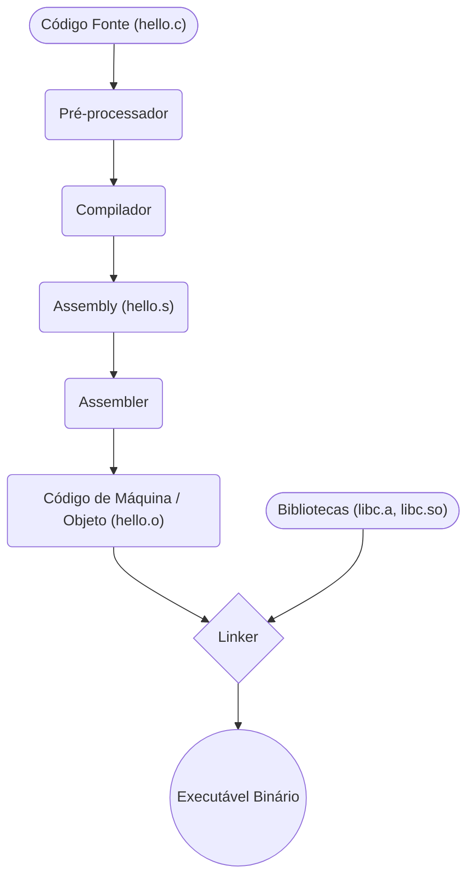

# Aula 01 - Como o Software Roda no Hardware

Nesta aula introdutória, faremos a descida do nível abstrato (código-fonte) até a realidade elétrica (processador). A compreensão clássica da interface *Hardware/Software* é o que difere programadores comuns de engenheiros com visão arquitetural.

---

## 🏗️ 1. O Abismo entre Código e Silício

Escrevemos *software* (como C/C++, Java, Python) usando linguagens compreensíveis a humanos, porém processadores processam apenas **Sinais Elétricos** ou, abstraindo para o domínio digital, **Binários (0 e 1)**.

Como a sua frase `printf("Hello World");` chega aos pinos do processador? Através de uma cadeia de ferramentas (*Toolchain*).

### O Processo de Compilação (C/C++)

Linguagens compiladas de baixo nível seguem um caminho determinístico. Veja o diagrama abaixo de como um arquivo `.c` é fatiado:



> [!INFO]
> **Você sabia?** O compilador (ex: GCC) traduz o C/C++ não para 0s e 1s de imediato, mas para **Assembly** — a representação textual do código de máquina, única para cada arquitetura.

---

## 🛠️ 2. Compiladores vs Interpretadores

A forma como seu código vira máquina dita o perfil da performance:

=== "Linguagens Compiladas (C/C++, Rust, Go)"
    O código é 100% transformado em binário *antes* de executar (AOT - Ahead of Time).
    **Pró**: Alta velocidade de execução. Hardware direto.
    **Contra**: O executável construído em Linux-x86 não roda nativamente em Windows-ARM sem ser recompilado.

=== "Linguagens Interpretadas (Python, Ruby)"
    Um programa (Interpretador) lê o seu código fonte em tempo de execução e executa as ações simulando o comando subjacente para o S.O.
    **Pró**: Roda em qualquer SO que tiver o interpretador.
    **Contra**: Muito mais lento, por sofrer *overhead* da interpretação.

=== "Linguagens Híbridas (Java, C#)"
    Compilam para um formato intermediário (*Bytecode*), e a JVM ou CLR as compila JIT (Just-In-Time) na máquina cliente no instante de executar.

---

## 📐 3. ISA: O Contrato do Processador

**ISA (Instruction Set Architecture)** é o dicionário de um processador. É o conjunto de comandos numéricos que o CPU sabe, fisicamente, executar:

* *Puxar da Memória (LOAD)*
* *Somar (ADD)*
* *Gravar na Memória (STORE)*

Todo código, por mais sofisticado que seja, precisa ser reduzido a estas poucas operações ditadas pela ISA para rodar.

<div class="termy" markdown="1">

```console
$ gcc -O2 -S hello.c
$ cat hello.s
main:
    pushq   %rbp
    movq    %rsp, %rbp
    leaq    .LC0(%rip), %rdi
    call    puts@PLT
```

</div>

*Acima, o output é o assembly x86 do seu C. É a representação literal da série de instruções que formarão a ISA do seu microprocessador Intel/AMD.*

---

## 🚀 Resumo Prático

- Ao usar C/C++, você não lida com um motor intermediário te cobrindo (como a JVM), você escreve algoritmos cuja gestão é delegada ao S.O. e rodada pura em metal.
- O programador backend / performance critica deve inspecionar eventuais outputs em *Assembly* para verificar se a abordagem da linguagem otimiza tempo de registrador.

Pronto para entender profundamente os dados no Módulo Binário?


---

## 🎯 Próximos Passos

<div class="grid cards" markdown>

-   :octicons-video-24: **Acessar Slides**

    ---
    
    Reveja a apresentação visual desta aula.
    
    [:octicons-arrow-right-24: Ver Slides da Aula](../slides/slide-01.html)

-   :octicons-tasklist-24: **Quiz**

    ---
    
    Teste seu entendimento básico com perguntas rápidas.
    
    [:octicons-arrow-right-24: Responder Quiz](../quizzes/quiz-01.md)

-   :octicons-pencil-24: **Exercícios**

    ---
    
    Prática avançada e dissertativa com consulta.
    
    [:octicons-arrow-right-24: Lista de Exercícios](../exercicios/exercicio-01.md)

-   :octicons-rocket-24: **Projeto**

    ---
    
    Laboratório prático de codificação em C/C++.
    
    [:octicons-arrow-right-24: Mini Projeto](../projetos/projeto-01.md)

</div>


[:octicons-arrow-right-24: Avançar para Aula 02](aula-02.md){ .md-button .md-button--primary }
