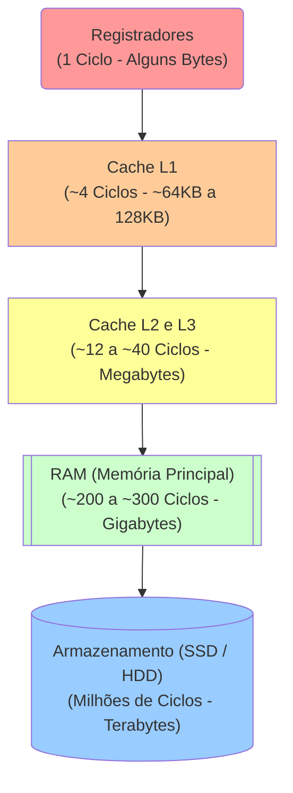

# Aula 05 - Hierarquia de Memória

A memória é o maior gargalo oculto no software moderno de alta concorrência. Quanto mais próximo o dado está da CPU, mais rápido é o acesso. Mas a velocidade custa dinheiro e escala térmica.

---

## 🏛️ 1. A Pirâmide de Alta Performance

Um programador ingênuo acha que "variável vai na memória". Um engenheiro de software C/C++ sabe *em qual camada* a variável se hospeda:



> [!IMPORTANT]
> A latência é o tempo que demora da CPU pedir um dado até ele chegar. Buscar um byte da **RAM** demora ~200 ciclos. Buscar do **SSD** demora centenas de milhares. Essa diferença grotesca é mitigada pelo uso de Caches.

---

## ⏳ 2. Os Impactos da Latência (Lado do Código)

Quando escrevemos um código com constantes consultas não linearizadas ao Banco de Dados (ou SSD local), pagamos a mais cara taxa processual: o I/O disk penalty.

<!-- termynal -->
```console
$ # Como consultar as camadas do processador Linux
$ lscpu | grep Cache
L1d cache:                       64 KiB
L1i cache:                       64 KiB
L2 cache:                        1 MiB
L3 cache:                        12 MiB
```

A instrução e os dados descem da L3, saltam para L2, descem para L1 e se acoplam na ALU.

---

## 🎯 3. Optimizando Uso

Por que linguagens como C e C++ dominam infraestrutura de servidores High Frequency Trading?
Porque elas permitem `Alocação Estática e Constante` que é perfeitamente "encaixada" pelo compilador diretamente na memória **Cache**.

Ao invés de carregar gigabytes de *Strings* na lenta RAM, as linguagens de baixo nível incentivam o uso de matrizes de tamanho delimitado (arrays fixos), cujo agrupamento contíguo força a arquitetura de **Hardware Prefetching** a adiantar os bytes do Array para a Cache nativamente, antes mesmo de você rodar a linha do código!

## 🚀 Resumo Prático

- Se processadores hoje são mísseis atingindo +4GHz, a RAM parou no tempo (Latência de CAS não baixa proporcionalmente).
- Tudo recai na técnica humana de amarrar dados juntos (Caches L1 e L2) e escrever *data-oriented code* se quiser ultra-latência C++.


---

## 🎯 Próximos Passos

<div class="grid cards" markdown>

-   :octicons-video-24: **Acessar Slides**

    ---
    
    Reveja a apresentação visual desta aula.
    
    [:octicons-arrow-right-24: Ver Slides da Aula](../slides/slide-05.html)

-   :octicons-tasklist-24: **Quiz**

    ---
    
    Teste seu entendimento básico com perguntas rápidas.
    
    [:octicons-arrow-right-24: Responder Quiz](../quizzes/quiz-05.md)

-   :octicons-pencil-24: **Exercícios**

    ---
    
    Prática avançada e dissertativa com consulta.
    
    [:octicons-arrow-right-24: Lista de Exercícios](../exercicios/exercicio-05.md)

-   :octicons-rocket-24: **Projeto**

    ---
    
    Laboratório prático de codificação em C/C++.
    
    [:octicons-arrow-right-24: Mini Projeto](../projetos/projeto-05.md)

</div>


[:octicons-arrow-right-24: Avançar para Aula 06](aula-06.md){ .md-button .md-button--primary }
