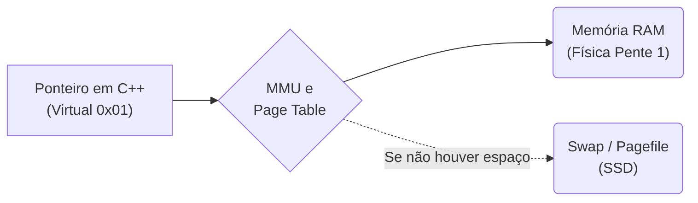

# Aula 08 - Memória Virtual

Se você pedir ao seu S.O. no Task Manager por quantos Gigabytes os aplicativos rodam, verá que a soma ultrapassa facilmente a capacidade real física do pente de RAM DDR inserido na placa mãe. Como isso é magicamente contido?

---

## 🕳️ 1. O Abismo Lógico: A Memória Virtual

Nenhum aplicativo C/C++ ou interpretador em execução roda interagindo fisicamente e sabendo explicitamente qual é o transistor fixo lá no pente da Kingston RAM na placa do data-center.

Todo processo que o Linux constrói roda dentro de uma gigante **Ilusão**. O endereço do seu ponteiro `0x7ffeeB...` em C++ é falso (Endereço Lógico).

O HW (Hardware MMU no processador) mais as planilhas do Sistema Operacional (Page Tables) formencem a ligação dinâmica e escondida pra sua aplicação.

A **Memória Virtual (VM)** é um sanduíche mental e isolador protetor usado pelo S.O.
Ela entrega para o ponteiro do processo o pretexto visual de que ele tem toda a memória que ele quiser num universo contínuo livre.

---

## 📄 2. TLB, MMU e a Tradução da Página

> Cada tradução do falso ponteiro visual com base nas tabelas em RAM é custoso (Cycle Penalty).

Para driblar isso, a arquitetura moderna usa a **TLB (Translation Lookaside Buffer)**. A TLB é uma Cache dentro da CPU que guarda apenas os dicionários recentes das planilhas de referências que dizem se o "0X7FFA falso vira bloco 344 do pente de DDR5 real".

=== "Page Hit e Page Fault"
    - **Page Hit:** A tradução ocorreu instatâneamente pela cache veloz na CPU (a TLB validou o ponteiro do C++ localizando logo onde está no metal a variável no chip Kingston).
    - **Page Fault Limitrofico:** A TLB errou e teve que rolar pra Main RAM puxando o endereço mapeado localizando num novo cluster na pilha. (100+ ciclos)
    - **Page Fault Crítico (SWAP):** A máquina não acha e entra em Swapping com o SSD (SSD Swap). É ali que ocorre as quedas colossais para "Travamento de Janela", a CPU foi pro SSD buscar um arquivo gigante que o Linux ejetou lá, pra trazer e rebotar pra cima pra Memória RAM física real, jogando pro seu código que achava estar "na memória" e dormiu (Milhões de ciclos).

---

## 💪 3. Driblando a Paginação como Programador

Ao iterarmos matrizes massivas (Matrizes 2D em C++) na ordem invertida ou em lógicas dispersas `LinkedList->prox`, você não causa apenas *Cache Miss* da Aula 06. Você também destrói toda a cache de pontes *TLB Misses*! Você induzirá Page Faults insanos que derrubarão o throughput (taxa de transferência de dados) em N fatores.

Portanto: **Localidade Espacial é sagrada em Dados C/C++**.

## 🚀 Resumo Prático

- O ponteiro que o dev manipula com um `int *ptr = &value` em qualquer IDE é puramente 100% Virtual. É o passaporte intermediário.
- Nunca dependa da paginação e arquivo local de Swap do Disco: os milésimos de segundo viram minutos na Nuvem se o app "estourar a cota da cloud", sofrendo `Thrashing` com o Disco local para falsificar a RAM que ele acreditou ter num loop mal codificado ou em Leaks do Módulo/Aula anterior.

---

## 🎯 Próximos Passos

-   :octicons-video-24: **Acessar Slides**

    ---
    
    Reveja a apresentação visual desta aula.
    
    [:octicons-arrow-right-24: Ver Slides da Aula](../slides/slide-08.html)

-   :octicons-tasklist-24: **Quiz**

    ---
    
    Teste seu entendimento básico com perguntas rápidas.
    
    [:octicons-arrow-right-24: Responder Quiz](../quizzes/quiz-08.html)

-   :octicons-pencil-24: **Exercícios**

    ---
    
    Prática avançada e dissertativa com consulta.
    
    [:octicons-arrow-right-24: Lista de Exercícios](../exercicios/exercicio-08.md)

-   :octicons-rocket-24: **Projeto**

    ---
    
    Laboratório prático de codificação em C/C++.
    
    [:octicons-arrow-right-24: Mini Projeto](../projetos/projeto-08.md)

[:octicons-arrow-right-24: Avançar para Aula 09](aula-09.md){ .md-button .md-button--primary }
