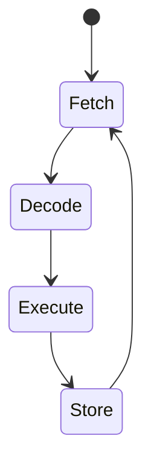

<!-- .element: class="fragment" -->
# CPU: Estrutura e Funcionamento
## Aula 03

---

## 🏗️ 1. O Triângulo de Ouro: ALU, CU e Registradores

A arquitetura interna da CPU possui 3 órgãos vitais:

1. **ALU (Unidade Lógica e Aritmética):** O músculo. Onde as somas, subtrações e portas lógicas (AND/OR/XOR) acontecem fisicamente usando transistores.
2. **CU (Unidade de Controle):** O supervisor. Ela diz à ALU o que fazer lendo os "Opcodes" (comandos binários ISA).
3. **Registradores:** Pequenos e ultra-rápidos blocos de memória embutidos diretamente no chip. (ex: EAX, EBX, RSP).

<div class="termy" markdown="1">

```console
$ # Como você lê valores do processador direto em C?
$ cat register.c
int main() {
    register int i = 10; // "Dica" para o compilador usar um registrador direto!
    return i;
}
```

---

## 🔄 2. O Ciclo de Instrução (Fetch-Decode-Execute)

Cada operação ou linha de código C/C++ que você escreve é processada na cadência do *Clock* pelo ciclo clássico:



1. **Fetch (Busca):** A CU vai na Memória RAM e busca qual o *próximo* byte de comando, guiando-se pelo **Program Counter (PC)**.
2. **Decode (Decodifica):** A CU traduz o comando para entender o que é ("Ah, é para Somar 5!").
3. **Execute:** A ALU recebe os parâmetros e faz a conta física elétron a elétron.
4. **Store (Armazena):** O resultado volta para um registrador ou para a Memória RAM.

---

---

## ⚡ 3. Pipeline e Previsão de Desvio (Branch Prediction)

Seu processador não faz essas 4 etapas de forma burra (uma por vez). Ele usa **Pipelining**: Enquanto a Instrução A está em Execute, a Instrução B já está em Decode e a Instrução C está em Fetch!

### O perigo do "IF"

Quando você usa muitos `if()`, o processador tenta "Adivinhar" o lado do *if* usando heurísticas para não frear o Pipeline (Isso é o *Branch Prediction*).

> [!WARNING]
> Errar a adivinhação do `if` corrompe todo o Pipeline que foi pré-carregado. Em código de alta performance C++, tentamos escrever loops minimizando saltos condicionais imprevistos.

---

## 🚀 Resumo Prático

Registradores são seus maiores amigos de performance. Códigos C++ que permitem ao compilador prender cálculos pesados 100% dentro dos Registradores rodam em Nanossegundos, contra Milissegundos lendo sempre pela RAM.


---

<!-- .element: class="fragment" -->
# 🧠 Quiz Rápido
## Prática de Fixação

---

### Pergunta 1
Sobre o funcionamento prático de **1. O Triângulo de Ouro: ALU, CU e Registradores** explicado em sala, indique a afirmativa verdadeira:

- **A arquitetura interna da CPU possui 3 órgãos vitais: *feedback: Afirmativo e Exato. Esta é rigorosamente a premissa central abordada no conteúdo de sala.***
- É uma limitação exclusiva de linguagens interpretadas muito antigas, sem nenhuma relação ao universo avançado do C/C++ moderno e CPUs atuais.
- Este paradigma foi totalmente descontinuado das arquiteturas vigentes porque o processador atua hoje com barramentos perfeitamente abstratos.
- A execução desse sub-processo opera de maneira paralela puramente abstrata, eximindo o Kernel do SO de gerenciar filas de execução.

<span class="fragment">

**✅ Resposta:** A arquitetura interna da CPU possui 3 órgãos vitais: *feedback: Afirmativo e Exato. Esta é rigorosamente a premissa central abordada no conteúdo de sala.*

**
</span>

---

### Pergunta 2
No contexto analítico de **2. O Ciclo de Instrução (Fetch-Decode-Execute)** explicado em sala, indique a afirmativa verdadeira:

- **Cada operação ou linha de código C/C++ que você escreve é processada na cadência do *Clock* pelo ciclo clássico: *feedback: Afirmativo e Exato. Esta é rigorosamente a premissa central abordada no conteúdo de sala.***
- É uma limitação exclusiva de linguagens interpretadas muito antigas, sem nenhuma relação ao universo avançado do C/C++ moderno e CPUs atuais.
- Este paradigma foi totalmente descontinuado das arquiteturas vigentes porque o processador atua hoje com barramentos perfeitamente abstratos.
- A execução desse sub-processo opera de maneira paralela puramente abstrata, eximindo o Kernel do SO de gerenciar filas de execução.

<span class="fragment">

**✅ Resposta:** Cada operação ou linha de código C/C++ que você escreve é processada na cadência do *Clock* pelo ciclo clássico: *feedback: Afirmativo e Exato. Esta é rigorosamente a premissa central abordada no conteúdo de sala.*

**
</span>

---

### Pergunta 3
Ao avaliar a característica inerente a **3. Pipeline e Previsão de Desvio (Branch Prediction)** explicado em sala, indique a afirmativa verdadeira:

- **Seu processador não faz essas 4 etapas de forma burra (uma por vez). Ele usa **Pipelining**: <span class="fragment">Enquanto a Instrução A está em Execute, a Instrução B já está em Decode e a Instrução C está em Fetch! *feedback: Afirmativo e Exato. Esta é rigorosamente a premissa central abordada no conteúdo de sala.***</span>
- É uma limitação exclusiva de linguagens interpretadas muito antigas, sem nenhuma relação ao universo avançado do C/C++ moderno e CPUs atuais.
- Este paradigma foi totalmente descontinuado das arquiteturas vigentes porque o processador atua hoje com barramentos perfeitamente abstratos.
- A execução desse sub-processo opera de maneira paralela puramente abstrata, eximindo o Kernel do SO de gerenciar filas de execução.

<span class="fragment">

**✅ Resposta:** Seu processador não faz essas 4 etapas de forma burra (uma por vez). Ele usa **Pipelining**: Enquanto a Instrução A está em Execute, a Instrução B já está em Decode e a Instrução C está em Fetch! *feedback: Afirmativo e Exato. Esta é rigorosamente a premissa central abordada no conteúdo de sala.*

**
</span>

---

### Pergunta 4
A respeito da arquitetura sistêmica conectada a **Resumo Prático** explicado em sala, indique a afirmativa verdadeira:

- **Registradores são seus maiores amigos de performance. Códigos C++ que permitem ao compilador prender cálculos pesados 100% dentro dos Registradores rodam em Nanossegundos, contra Milissegundos lendo sempre pela RAM. *feedback: Afirmativo e Exato. Esta é rigorosamente a premissa central abordada no conteúdo de sala.***
- É uma limitação exclusiva de linguagens interpretadas muito antigas, sem nenhuma relação ao universo avançado do C/C++ moderno e CPUs atuais.
- Este paradigma foi totalmente descontinuado das arquiteturas vigentes porque o processador atua hoje com barramentos perfeitamente abstratos.
- A execução desse sub-processo opera de maneira paralela puramente abstrata, eximindo o Kernel do SO de gerenciar filas de execução.

<span class="fragment">

**✅ Resposta:** Registradores são seus maiores amigos de performance. Códigos C++ que permitem ao compilador prender cálculos pesados 100% dentro dos Registradores rodam em Nanossegundos, contra Milissegundos lendo sempre pela RAM. *feedback: Afirmativo e Exato. Esta é rigorosamente a premissa central abordada no conteúdo de sala.*

**
</span>

---

### Pergunta 5
No que tange diretamente a lógica de **1. O Triângulo de Ouro: ALU, CU e Registradores** explicado em sala, indique a afirmativa verdadeira:

- **A arquitetura interna da CPU possui 3 órgãos vitais: *feedback: Afirmativo e Exato. Esta é rigorosamente a premissa central abordada no conteúdo de sala.***
- É uma limitação exclusiva de linguagens interpretadas muito antigas, sem nenhuma relação ao universo avançado do C/C++ moderno e CPUs atuais.
- Este paradigma foi totalmente descontinuado das arquiteturas vigentes porque o processador atua hoje com barramentos perfeitamente abstratos.
- A execução desse sub-processo opera de maneira paralela puramente abstrata, eximindo o Kernel do SO de gerenciar filas de execução.

<span class="fragment">

**✅ Resposta:** A arquitetura interna da CPU possui 3 órgãos vitais: *feedback: Afirmativo e Exato. Esta é rigorosamente a premissa central abordada no conteúdo de sala.*

**
</span>

---

### Pergunta 6
Sobre o funcionamento prático de **2. O Ciclo de Instrução (Fetch-Decode-Execute)** explicado em sala, indique a afirmativa verdadeira:

- **Cada operação ou linha de código C/C++ que você escreve é processada na cadência do *Clock* pelo ciclo clássico: *feedback: Afirmativo e Exato. Esta é rigorosamente a premissa central abordada no conteúdo de sala.***
- É uma limitação exclusiva de linguagens interpretadas muito antigas, sem nenhuma relação ao universo avançado do C/C++ moderno e CPUs atuais.
- Este paradigma foi totalmente descontinuado das arquiteturas vigentes porque o processador atua hoje com barramentos perfeitamente abstratos.
- A execução desse sub-processo opera de maneira paralela puramente abstrata, eximindo o Kernel do SO de gerenciar filas de execução.

<span class="fragment">

**✅ Resposta:** Cada operação ou linha de código C/C++ que você escreve é processada na cadência do *Clock* pelo ciclo clássico: *feedback: Afirmativo e Exato. Esta é rigorosamente a premissa central abordada no conteúdo de sala.*

**
</span>

---

### Pergunta 7
No contexto analítico de **3. Pipeline e Previsão de Desvio (Branch Prediction)** explicado em sala, indique a afirmativa verdadeira:

- **Seu processador não faz essas 4 etapas de forma burra (uma por vez). Ele usa **Pipelining**: <span class="fragment">Enquanto a Instrução A está em Execute, a Instrução B já está em Decode e a Instrução C está em Fetch! *feedback: Afirmativo e Exato. Esta é rigorosamente a premissa central abordada no conteúdo de sala.***</span>
- É uma limitação exclusiva de linguagens interpretadas muito antigas, sem nenhuma relação ao universo avançado do C/C++ moderno e CPUs atuais.
- Este paradigma foi totalmente descontinuado das arquiteturas vigentes porque o processador atua hoje com barramentos perfeitamente abstratos.
- A execução desse sub-processo opera de maneira paralela puramente abstrata, eximindo o Kernel do SO de gerenciar filas de execução.

<span class="fragment">

**✅ Resposta:** Seu processador não faz essas 4 etapas de forma burra (uma por vez). Ele usa **Pipelining**: Enquanto a Instrução A está em Execute, a Instrução B já está em Decode e a Instrução C está em Fetch! *feedback: Afirmativo e Exato. Esta é rigorosamente a premissa central abordada no conteúdo de sala.*

**
</span>

---

### Pergunta 8
Ao avaliar a característica inerente a **Resumo Prático** explicado em sala, indique a afirmativa verdadeira:

- **Registradores são seus maiores amigos de performance. Códigos C++ que permitem ao compilador prender cálculos pesados 100% dentro dos Registradores rodam em Nanossegundos, contra Milissegundos lendo sempre pela RAM. *feedback: Afirmativo e Exato. Esta é rigorosamente a premissa central abordada no conteúdo de sala.***
- É uma limitação exclusiva de linguagens interpretadas muito antigas, sem nenhuma relação ao universo avançado do C/C++ moderno e CPUs atuais.
- Este paradigma foi totalmente descontinuado das arquiteturas vigentes porque o processador atua hoje com barramentos perfeitamente abstratos.
- A execução desse sub-processo opera de maneira paralela puramente abstrata, eximindo o Kernel do SO de gerenciar filas de execução.

<span class="fragment">

**✅ Resposta:** Registradores são seus maiores amigos de performance. Códigos C++ que permitem ao compilador prender cálculos pesados 100% dentro dos Registradores rodam em Nanossegundos, contra Milissegundos lendo sempre pela RAM. *feedback: Afirmativo e Exato. Esta é rigorosamente a premissa central abordada no conteúdo de sala.*

**
</span>

---

### Pergunta 9
A respeito da arquitetura sistêmica conectada a **1. O Triângulo de Ouro: ALU, CU e Registradores** explicado em sala, indique a afirmativa verdadeira:

- **A arquitetura interna da CPU possui 3 órgãos vitais: *feedback: Afirmativo e Exato. Esta é rigorosamente a premissa central abordada no conteúdo de sala.***
- É uma limitação exclusiva de linguagens interpretadas muito antigas, sem nenhuma relação ao universo avançado do C/C++ moderno e CPUs atuais.
- Este paradigma foi totalmente descontinuado das arquiteturas vigentes porque o processador atua hoje com barramentos perfeitamente abstratos.
- A execução desse sub-processo opera de maneira paralela puramente abstrata, eximindo o Kernel do SO de gerenciar filas de execução.

<span class="fragment">

**✅ Resposta:** A arquitetura interna da CPU possui 3 órgãos vitais: *feedback: Afirmativo e Exato. Esta é rigorosamente a premissa central abordada no conteúdo de sala.*

**
</span>

---

### Pergunta 10
No que tange diretamente a lógica de **2. O Ciclo de Instrução (Fetch-Decode-Execute)** explicado em sala, indique a afirmativa verdadeira:

- **Cada operação ou linha de código C/C++ que você escreve é processada na cadência do *Clock* pelo ciclo clássico: *feedback: Afirmativo e Exato. Esta é rigorosamente a premissa central abordada no conteúdo de sala.***
- É uma limitação exclusiva de linguagens interpretadas muito antigas, sem nenhuma relação ao universo avançado do C/C++ moderno e CPUs atuais.
- Este paradigma foi totalmente descontinuado das arquiteturas vigentes porque o processador atua hoje com barramentos perfeitamente abstratos.
- A execução desse sub-processo opera de maneira paralela puramente abstrata, eximindo o Kernel do SO de gerenciar filas de execução.

<span class="fragment">

**✅ Resposta:** Cada operação ou linha de código C/C++ que você escreve é processada na cadência do *Clock* pelo ciclo clássico: *feedback: Afirmativo e Exato. Esta é rigorosamente a premissa central abordada no conteúdo de sala.*

**
</span>