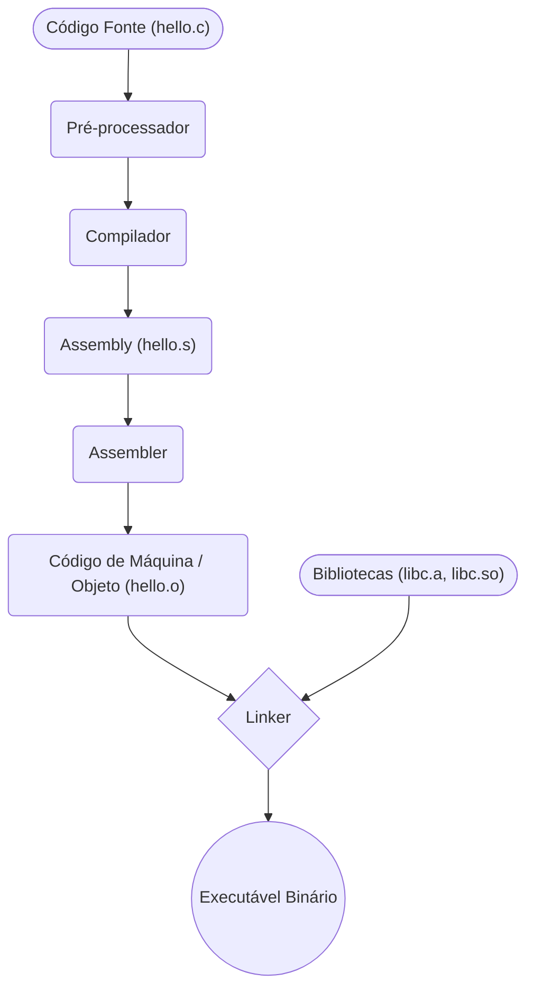

<!-- .element: class="fragment" -->
# Aula 01 - Como o Software Roda no Hardware
## Apresentação

---

Nesta aula introdutória, faremos a descida do nível abstrato (código-fonte) até a realidade elétrica (processador). A compreensão clássica da interface *Hardware/Software* é o que difere programadores comuns de engenheiros com visão arquitetural.

---

---

<!-- .element: class="fragment" -->
# Novo Tópico
## 🏗️ 1. O Abismo entre Código e Silício

---

## 🏗️ 1. O Abismo entre Código e Silício

Escrevemos *software* (como C/C++, Java, Python) usando linguagens compreensíveis a humanos, porém processadores processam apenas **Sinais Elétricos** ou, abstraindo para o domínio digital, **Binários (0 e 1)**.

Como a sua frase `printf("Hello World");` chega aos pinos do processador? Através de uma cadeia de ferramentas (*Toolchain*).

---

## 🏗️ 1. O Abismo entre Código e Silício

### O Processo de Compilação (C/C++)

---

## 🏗️ 1. O Abismo entre Código e Silício

Linguagens compiladas de baixo nível seguem um caminho determinístico. Veja o diagrama abaixo de como um arquivo `.c` é fatiado:

---

## 🏗️ 1. O Abismo entre Código e Silício



---

## 🏗️ 1. O Abismo entre Código e Silício

> [!INFO]
> **Você sabia?** O compilador (ex: GCC) traduz o C/C++ não para 0s e 1s de imediato, mas para **Assembly** — a representação textual do código de máquina, única para cada arquitetura.

---

## 🏗️ 1. O Abismo entre Código e Silício

---

---

<!-- .element: class="fragment" -->
# Novo Tópico
## 🛠️ 2. Compiladores vs Interpretadores

---

## 🛠️ 2. Compiladores vs Interpretadores

A forma como seu código vira máquina dita o perfil da performance:

---

## 🛠️ 2. Compiladores vs Interpretadores

### Linguagens Compiladas (C/C++, Rust, Go)

<span class="fragment">O código é 100% transformado em binário *antes* de executar (AOT - Ahead of Time).
    **Pró**: Alta velocidade de execução. Hardware direto.
    **Contra**: O executável construído em Linux-x86 não roda nativamente em Windows-ARM sem ser recompilado.</span>

---

## 🛠️ 2. Compiladores vs Interpretadores

### Linguagens Interpretadas (Python, Ruby)

<span class="fragment">Um programa (Interpretador) lê o seu código fonte em tempo de execução e executa as ações simulando o comando subjacente para o S.O.
    **Pró**: Roda em qualquer SO que tiver o interpretador.
    **Contra**: Muito mais lento, por sofrer *overhead* da interpretação.</span>

---

## 🛠️ 2. Compiladores vs Interpretadores

### Linguagens Híbridas (Java, C#)

<span class="fragment">Compilam para um formato intermediário (*Bytecode*), e a JVM ou CLR as compila JIT (Just-In-Time) na máquina cliente no instante de executar.</span>

---

## 🛠️ 2. Compiladores vs Interpretadores

---

---

<!-- .element: class="fragment" -->
# Novo Tópico
## 📐 3. ISA: O Contrato do Processador

---

## 📐 3. ISA: O Contrato do Processador

**ISA (Instruction Set Architecture)** é o dicionário de um processador. É o conjunto de comandos numéricos que o CPU sabe, fisicamente, executar:

---

## 📐 3. ISA: O Contrato do Processador

* *Puxar da Memória (LOAD)*
* *Somar (ADD)*
* *Gravar na Memória (STORE)*

---

## 📐 3. ISA: O Contrato do Processador

Todo código, por mais sofisticado que seja, precisa ser reduzido a estas poucas operações ditadas pela ISA para rodar.

---

## 📐 3. ISA: O Contrato do Processador

<!-- termynal -->
```console
$ gcc -O2 -S hello.c
$ cat hello.s
main:
    pushq   %rbp
    movq    %rsp, %rbp
    leaq    .LC0(%rip), %rdi
    call    puts@PLT
```

---

## 📐 3. ISA: O Contrato do Processador

*Acima, o output é o assembly x86 do seu C. É a representação literal da série de instruções que formarão a ISA do seu microprocessador Intel/AMD.*

---

## 📐 3. ISA: O Contrato do Processador

---

---

<!-- .element: class="fragment" -->
# Novo Tópico
## 🚀 Resumo Prático

---

## 🚀 Resumo Prático

- Ao usar C/C++, você não lida com um motor intermediário te cobrindo (como a JVM), você escreve algoritmos cuja gestão é delegada ao S.O. e rodada pura em metal.
- O programador backend / performance critica deve inspecionar eventuais outputs em *Assembly* para verificar se a abordagem da linguagem otimiza tempo de registrador.

---

## 🚀 Resumo Prático

Pronto para entender profundamente os dados no Módulo Binário?

---