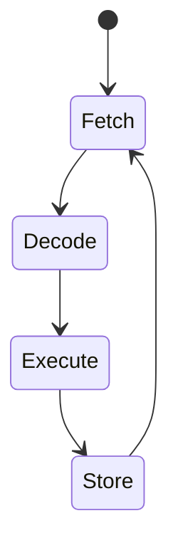

<!-- .element: class="fragment" -->
# Aula 03 - CPU: Estrutura e Funcionamento
## Apresentação

---

Como as operações chegam e são tratadas pela verdadeira mente do computador? A CPU (Unidade Central de Processamento) não é mágica, ela segue um ciclo de pulso rígido orquestrado pelo *Clock*.

---

---

<!-- .element: class="fragment" -->
# Novo Tópico
## 🏗️ 1. O Triângulo de Ouro: ALU, CU e Registradores

---

## 🏗️ 1. O Triângulo de Ouro: ALU, CU e Registradores

A arquitetura interna da CPU possui 3 órgãos vitais:

1. **ALU (Unidade Lógica e Aritmética):** O músculo. Onde as somas, subtrações e portas lógicas (AND/OR/XOR) acontecem fisicamente usando transistores.
2. **CU (Unidade de Controle):** O supervisor. Ela diz à ALU o que fazer lendo os "Opcodes" (comandos binários ISA).
3. **Registradores:** Pequenos e ultra-rápidos blocos de memória embutidos diretamente no chip. (ex: EAX, EBX, RSP).

---

## 🏗️ 1. O Triângulo de Ouro: ALU, CU e Registradores

<!-- termynal -->
```console
$ # Como você lê valores do processador direto em C?
$ cat register.c
int main() {
    register int i = 10; // "Dica" para o compilador usar um registrador direto!
    return i;
}
```

---

## 🏗️ 1. O Triângulo de Ouro: ALU, CU e Registradores

---

---

<!-- .element: class="fragment" -->
# Novo Tópico
## 🔄 2. O Ciclo de Instrução (Fetch-Decode-Execute)

---

## 🔄 2. O Ciclo de Instrução (Fetch-Decode-Execute)

Cada operação ou linha de código C/C++ que você escreve é processada na cadência do *Clock* pelo ciclo clássico:

---

## 🔄 2. O Ciclo de Instrução (Fetch-Decode-Execute)



---

## 🔄 2. O Ciclo de Instrução (Fetch-Decode-Execute)

1. **Fetch (Busca):** A CU vai na Memória RAM e busca qual o *próximo* byte de comando, guiando-se pelo **Program Counter (PC)**.
2. **Decode (Decodifica):** A CU traduz o comando para entender o que é ("Ah, é para Somar 5!").
3. **Execute:** A ALU recebe os parâmetros e faz a conta física elétron a elétron.
4. **Store (Armazena):** O resultado volta para um registrador ou para a Memória RAM.

---

---

<!-- .element: class="fragment" -->
# Novo Tópico
## ⚡ 3. Pipeline e Previsão de Desvio (Branch Prediction)

---

## ⚡ 3. Pipeline e Previsão de Desvio (Branch Prediction)

Seu processador não faz essas 4 etapas de forma burra (uma por vez). Ele usa **Pipelining**: Enquanto a Instrução A está em Execute, a Instrução B já está em Decode e a Instrução C está em Fetch!

---

## ⚡ 3. Pipeline e Previsão de Desvio (Branch Prediction)

### O perigo do "IF"

---

## ⚡ 3. Pipeline e Previsão de Desvio (Branch Prediction)

Quando você usa muitos `if()`, o processador tenta "Adivinhar" o lado do *if* usando heurísticas para não frear o Pipeline (Isso é o *Branch Prediction*).

---

## ⚡ 3. Pipeline e Previsão de Desvio (Branch Prediction)

> [!WARNING]
> Errar a adivinhação do `if` corrompe todo o Pipeline que foi pré-carregado. Em código de alta performance C++, tentamos escrever loops minimizando saltos condicionais imprevistos.

---

<!-- .element: class="fragment" -->
# Novo Tópico
## 🚀 Resumo Prático

---

## 🚀 Resumo Prático

Registradores são seus maiores amigos de performance. Códigos C++ que permitem ao compilador prender cálculos pesados 100% dentro dos Registradores rodam em Nanossegundos, contra Milissegundos lendo sempre pela RAM.

---