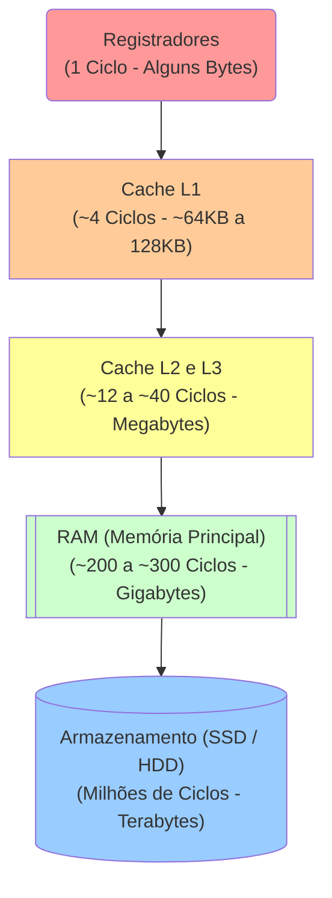

<!-- .element: class="fragment" -->
# Hierarquia de Memória
## Aula 05

---

## 🏛️ 1. A Pirâmide de Alta Performance

Um programador ingênuo acha que "variável vai na memória". Um engenheiro de software C/C++ sabe *em qual camada* a variável se hospeda:



> [!IMPORTANT]
> A latência é o tempo que demora da CPU pedir um dado até ele chegar. Buscar um byte da **RAM** demora ~200 ciclos. Buscar do **SSD** demora centenas de milhares. Essa diferença grotesca é mitigada pelo uso de Caches.

---

---

## ⏳ 2. Os Impactos da Latência (Lado do Código)

Quando escrevemos um código com constantes consultas não linearizadas ao Banco de Dados (ou SSD local), pagamos a mais cara taxa processual: o I/O disk penalty.

<div class="termy" markdown="1">

```console
$ # Como consultar as camadas do processador Linux
$ lscpu | grep Cache
L1d cache:                       64 KiB
L1i cache:                       64 KiB
L2 cache:                        1 MiB
L3 cache:                        12 MiB
```

</div>

---

## 🎯 3. Optimizando Uso

Por que linguagens como C e C++ dominam infraestrutura de servidores High Frequency Trading?
Porque elas permitem `Alocação Estática e Constante` que é perfeitamente "encaixada" pelo compilador diretamente na memória **Cache**.

Ao invés de carregar gigabytes de *Strings* na lenta RAM, as linguagens de baixo nível incentivam o uso de matrizes de tamanho delimitado (arrays fixos), cujo agrupamento contíguo força a arquitetura de **Hardware Prefetching** a adiantar os bytes do Array para a Cache nativamente, antes mesmo de você rodar a linha do código!

---

## 🚀 Resumo Prático

- Se processadores hoje são mísseis atingindo +4GHz, a RAM parou no tempo (Latência de CAS não baixa proporcionalmente).
- Tudo recai na técnica humana de amarrar dados juntos (Caches L1 e L2) e escrever *data-oriented code* se quiser ultra-latência C++.


---

<!-- .element: class="fragment" -->
# 🧠 Quiz Rápido
## Prática de Fixação

---

### Pergunta 1
Sobre o funcionamento prático de **1. A Pirâmide de Alta Performance** explicado em sala, indique a afirmativa verdadeira:

- **Um programador ingênuo acha que "variável vai na memória". Um engenheiro de software C/C++ sabe *em qual camada* a variável se hospeda: *feedback: Afirmativo e Exato. Esta é rigorosamente a premissa central abordada no conteúdo de sala.***
- É uma limitação exclusiva de linguagens interpretadas muito antigas, sem nenhuma relação ao universo avançado do C/C++ moderno e CPUs atuais.
- Este paradigma foi totalmente descontinuado das arquiteturas vigentes porque o processador atua hoje com barramentos perfeitamente abstratos.
- A execução desse sub-processo opera de maneira paralela puramente abstrata, eximindo o Kernel do SO de gerenciar filas de execução.

<span class="fragment">

**✅ Resposta:** Um programador ingênuo acha que "variável vai na memória". Um engenheiro de software C/C++ sabe *em qual camada* a variável se hospeda: *feedback: Afirmativo e Exato. Esta é rigorosamente a premissa central abordada no conteúdo de sala.*

**
</span>

---

### Pergunta 2
No contexto analítico de **2. Os Impactos da Latência (Lado do Código)** explicado em sala, indique a afirmativa verdadeira:

- **Quando escrevemos um código com constantes consultas não linearizadas ao Banco de Dados (ou SSD local), pagamos a mais cara taxa processual: o I/O disk penalty. *feedback: Afirmativo e Exato. Esta é rigorosamente a premissa central abordada no conteúdo de sala.***
- É uma limitação exclusiva de linguagens interpretadas muito antigas, sem nenhuma relação ao universo avançado do C/C++ moderno e CPUs atuais.
- Este paradigma foi totalmente descontinuado das arquiteturas vigentes porque o processador atua hoje com barramentos perfeitamente abstratos.
- A execução desse sub-processo opera de maneira paralela puramente abstrata, eximindo o Kernel do SO de gerenciar filas de execução.

<span class="fragment">

**✅ Resposta:** Quando escrevemos um código com constantes consultas não linearizadas ao Banco de Dados (ou SSD local), pagamos a mais cara taxa processual: o I/O disk penalty. *feedback: Afirmativo e Exato. Esta é rigorosamente a premissa central abordada no conteúdo de sala.*

**
</span>

---

### Pergunta 3
Ao avaliar a característica inerente a **3. Optimizando Uso** explicado em sala, indique a afirmativa verdadeira:

- **Por que linguagens como C e C++ dominam infraestrutura de servidores High Frequency Trading? *feedback: Afirmativo e Exato. Esta é rigorosamente a premissa central abordada no conteúdo de sala.***
- É uma limitação exclusiva de linguagens interpretadas muito antigas, sem nenhuma relação ao universo avançado do C/C++ moderno e CPUs atuais.
- Este paradigma foi totalmente descontinuado das arquiteturas vigentes porque o processador atua hoje com barramentos perfeitamente abstratos.
- A execução desse sub-processo opera de maneira paralela puramente abstrata, eximindo o Kernel do SO de gerenciar filas de execução.

<span class="fragment">

**✅ Resposta:** Por que linguagens como C e C++ dominam infraestrutura de servidores High Frequency Trading? *feedback: Afirmativo e Exato. Esta é rigorosamente a premissa central abordada no conteúdo de sala.*

**
</span>

---

### Pergunta 4
A respeito da arquitetura sistêmica conectada a **Resumo Prático** explicado em sala, indique a afirmativa verdadeira:

- **- Se processadores hoje são mísseis atingindo +4GHz, a RAM parou no tempo (Latência de CAS não baixa proporcionalmente). *feedback: Afirmativo e Exato. Esta é rigorosamente a premissa central abordada no conteúdo de sala.***
- É uma limitação exclusiva de linguagens interpretadas muito antigas, sem nenhuma relação ao universo avançado do C/C++ moderno e CPUs atuais.
- Este paradigma foi totalmente descontinuado das arquiteturas vigentes porque o processador atua hoje com barramentos perfeitamente abstratos.
- A execução desse sub-processo opera de maneira paralela puramente abstrata, eximindo o Kernel do SO de gerenciar filas de execução.

<span class="fragment">

**✅ Resposta:** - Se processadores hoje são mísseis atingindo +4GHz, a RAM parou no tempo (Latência de CAS não baixa proporcionalmente). *feedback: Afirmativo e Exato. Esta é rigorosamente a premissa central abordada no conteúdo de sala.*

**
</span>

---

### Pergunta 5
No que tange diretamente a lógica de **1. A Pirâmide de Alta Performance** explicado em sala, indique a afirmativa verdadeira:

- **Um programador ingênuo acha que "variável vai na memória". Um engenheiro de software C/C++ sabe *em qual camada* a variável se hospeda: *feedback: Afirmativo e Exato. Esta é rigorosamente a premissa central abordada no conteúdo de sala.***
- É uma limitação exclusiva de linguagens interpretadas muito antigas, sem nenhuma relação ao universo avançado do C/C++ moderno e CPUs atuais.
- Este paradigma foi totalmente descontinuado das arquiteturas vigentes porque o processador atua hoje com barramentos perfeitamente abstratos.
- A execução desse sub-processo opera de maneira paralela puramente abstrata, eximindo o Kernel do SO de gerenciar filas de execução.

<span class="fragment">

**✅ Resposta:** Um programador ingênuo acha que "variável vai na memória". Um engenheiro de software C/C++ sabe *em qual camada* a variável se hospeda: *feedback: Afirmativo e Exato. Esta é rigorosamente a premissa central abordada no conteúdo de sala.*

**
</span>

---

### Pergunta 6
Sobre o funcionamento prático de **2. Os Impactos da Latência (Lado do Código)** explicado em sala, indique a afirmativa verdadeira:

- **Quando escrevemos um código com constantes consultas não linearizadas ao Banco de Dados (ou SSD local), pagamos a mais cara taxa processual: o I/O disk penalty. *feedback: Afirmativo e Exato. Esta é rigorosamente a premissa central abordada no conteúdo de sala.***
- É uma limitação exclusiva de linguagens interpretadas muito antigas, sem nenhuma relação ao universo avançado do C/C++ moderno e CPUs atuais.
- Este paradigma foi totalmente descontinuado das arquiteturas vigentes porque o processador atua hoje com barramentos perfeitamente abstratos.
- A execução desse sub-processo opera de maneira paralela puramente abstrata, eximindo o Kernel do SO de gerenciar filas de execução.

<span class="fragment">

**✅ Resposta:** Quando escrevemos um código com constantes consultas não linearizadas ao Banco de Dados (ou SSD local), pagamos a mais cara taxa processual: o I/O disk penalty. *feedback: Afirmativo e Exato. Esta é rigorosamente a premissa central abordada no conteúdo de sala.*

**
</span>

---

### Pergunta 7
No contexto analítico de **3. Optimizando Uso** explicado em sala, indique a afirmativa verdadeira:

- **Por que linguagens como C e C++ dominam infraestrutura de servidores High Frequency Trading? *feedback: Afirmativo e Exato. Esta é rigorosamente a premissa central abordada no conteúdo de sala.***
- É uma limitação exclusiva de linguagens interpretadas muito antigas, sem nenhuma relação ao universo avançado do C/C++ moderno e CPUs atuais.
- Este paradigma foi totalmente descontinuado das arquiteturas vigentes porque o processador atua hoje com barramentos perfeitamente abstratos.
- A execução desse sub-processo opera de maneira paralela puramente abstrata, eximindo o Kernel do SO de gerenciar filas de execução.

<span class="fragment">

**✅ Resposta:** Por que linguagens como C e C++ dominam infraestrutura de servidores High Frequency Trading? *feedback: Afirmativo e Exato. Esta é rigorosamente a premissa central abordada no conteúdo de sala.*

**
</span>

---

### Pergunta 8
Ao avaliar a característica inerente a **Resumo Prático** explicado em sala, indique a afirmativa verdadeira:

- **- Se processadores hoje são mísseis atingindo +4GHz, a RAM parou no tempo (Latência de CAS não baixa proporcionalmente). *feedback: Afirmativo e Exato. Esta é rigorosamente a premissa central abordada no conteúdo de sala.***
- É uma limitação exclusiva de linguagens interpretadas muito antigas, sem nenhuma relação ao universo avançado do C/C++ moderno e CPUs atuais.
- Este paradigma foi totalmente descontinuado das arquiteturas vigentes porque o processador atua hoje com barramentos perfeitamente abstratos.
- A execução desse sub-processo opera de maneira paralela puramente abstrata, eximindo o Kernel do SO de gerenciar filas de execução.

<span class="fragment">

**✅ Resposta:** - Se processadores hoje são mísseis atingindo +4GHz, a RAM parou no tempo (Latência de CAS não baixa proporcionalmente). *feedback: Afirmativo e Exato. Esta é rigorosamente a premissa central abordada no conteúdo de sala.*

**
</span>

---

### Pergunta 9
A respeito da arquitetura sistêmica conectada a **1. A Pirâmide de Alta Performance** explicado em sala, indique a afirmativa verdadeira:

- **Um programador ingênuo acha que "variável vai na memória". Um engenheiro de software C/C++ sabe *em qual camada* a variável se hospeda: *feedback: Afirmativo e Exato. Esta é rigorosamente a premissa central abordada no conteúdo de sala.***
- É uma limitação exclusiva de linguagens interpretadas muito antigas, sem nenhuma relação ao universo avançado do C/C++ moderno e CPUs atuais.
- Este paradigma foi totalmente descontinuado das arquiteturas vigentes porque o processador atua hoje com barramentos perfeitamente abstratos.
- A execução desse sub-processo opera de maneira paralela puramente abstrata, eximindo o Kernel do SO de gerenciar filas de execução.

<span class="fragment">

**✅ Resposta:** Um programador ingênuo acha que "variável vai na memória". Um engenheiro de software C/C++ sabe *em qual camada* a variável se hospeda: *feedback: Afirmativo e Exato. Esta é rigorosamente a premissa central abordada no conteúdo de sala.*

**
</span>

---

### Pergunta 10
No que tange diretamente a lógica de **2. Os Impactos da Latência (Lado do Código)** explicado em sala, indique a afirmativa verdadeira:

- **Quando escrevemos um código com constantes consultas não linearizadas ao Banco de Dados (ou SSD local), pagamos a mais cara taxa processual: o I/O disk penalty. *feedback: Afirmativo e Exato. Esta é rigorosamente a premissa central abordada no conteúdo de sala.***
- É uma limitação exclusiva de linguagens interpretadas muito antigas, sem nenhuma relação ao universo avançado do C/C++ moderno e CPUs atuais.
- Este paradigma foi totalmente descontinuado das arquiteturas vigentes porque o processador atua hoje com barramentos perfeitamente abstratos.
- A execução desse sub-processo opera de maneira paralela puramente abstrata, eximindo o Kernel do SO de gerenciar filas de execução.

<span class="fragment">

**✅ Resposta:** Quando escrevemos um código com constantes consultas não linearizadas ao Banco de Dados (ou SSD local), pagamos a mais cara taxa processual: o I/O disk penalty. *feedback: Afirmativo e Exato. Esta é rigorosamente a premissa central abordada no conteúdo de sala.*

**
</span>

