```mermaid
graph TD
    A("Registradores<br/>(1 Ciclo - Alguns Bytes)") --> B["Cache L1<br/>(~4 Ciclos - ~64KB a 128KB)"]
    B --> C["Cache L2 e L3<br/>(~12 a ~40 Ciclos - Megabytes)"]
    C --> D[["RAM (Memória Principal)<br/>(~200 a ~300 Ciclos - Gigabytes)"]]
    D --> E[("Armazenamento (SSD / HDD)<br/>(Milhões de Ciclos - Terabytes)")]
    
    style A fill:#ff9999
    style B fill:#ffcc99
    style C fill:#ffff99
    style D fill:#ccffcc
    style E fill:#99ccff
```

<!-- .element: class="fragment" -->
# Aula 05 - Hierarquia de Memória
## Apresentação

---

A memória é o maior gargalo oculto no software moderno de alta concorrência. Quanto mais próximo o dado está da CPU, mais rápido é o acesso. Mas a velocidade custa dinheiro e escala térmica.

---

---

<!-- .element: class="fragment" -->
# Novo Tópico
## 🏛️ 1. A Pirâmide de Alta Performance

---

## 🏛️ 1. A Pirâmide de Alta Performance

Um programador ingênuo acha que "variável vai na memória". Um engenheiro de software C/C++ sabe *em qual camada* a variável se hospeda:

---

## 🏛️ 1. A Pirâmide de Alta Performance



---

## 🏛️ 1. A Pirâmide de Alta Performance

> [!IMPORTANT]
> A latência é o tempo que demora da CPU pedir um dado até ele chegar. Buscar um byte da **RAM** demora ~200 ciclos. Buscar do **SSD** demora centenas de milhares. Essa diferença grotesca é mitigada pelo uso de Caches.

---

## 🏛️ 1. A Pirâmide de Alta Performance

---

---

<!-- .element: class="fragment" -->
# Novo Tópico
## ⏳ 2. Os Impactos da Latência (Lado do Código)

---

## ⏳ 2. Os Impactos da Latência (Lado do Código)

Quando escrevemos um código com constantes consultas não linearizadas ao Banco de Dados (ou SSD local), pagamos a mais cara taxa processual: o I/O disk penalty.

---

## ⏳ 2. Os Impactos da Latência (Lado do Código)

<!-- termynal -->
```console
$ # Como consultar as camadas do processador Linux
$ lscpu | grep Cache
L1d cache:                       64 KiB
L1i cache:                       64 KiB
L2 cache:                        1 MiB
L3 cache:                        12 MiB
```

---

## ⏳ 2. Os Impactos da Latência (Lado do Código)

A instrução e os dados descem da L3, saltam para L2, descem para L1 e se acoplam na ALU.

---

---

<!-- .element: class="fragment" -->
# Novo Tópico
## 🎯 3. Optimizando Uso

---

## 🎯 3. Optimizando Uso

Por que linguagens como C e C++ dominam infraestrutura de servidores High Frequency Trading?
Porque elas permitem `Alocação Estática e Constante` que é perfeitamente "encaixada" pelo compilador diretamente na memória **Cache**.

Ao invés de carregar gigabytes de *Strings* na lenta RAM, as linguagens de baixo nível incentivam o uso de matrizes de tamanho delimitado (arrays fixos), cujo agrupamento contíguo força a arquitetura de **Hardware Prefetching** a adiantar os bytes do Array para a Cache nativamente, antes mesmo de você rodar a linha do código!

---

<!-- .element: class="fragment" -->
# Novo Tópico
## 🚀 Resumo Prático

---

## 🚀 Resumo Prático

- Se processadores hoje são mísseis atingindo +4GHz, a RAM parou no tempo (Latência de CAS não baixa proporcionalmente).
- Tudo recai na técnica humana de amarrar dados juntos (Caches L1 e L2) e escrever *data-oriented code* se quiser ultra-latência C++.

---

## 🚀 Resumo Prático

---