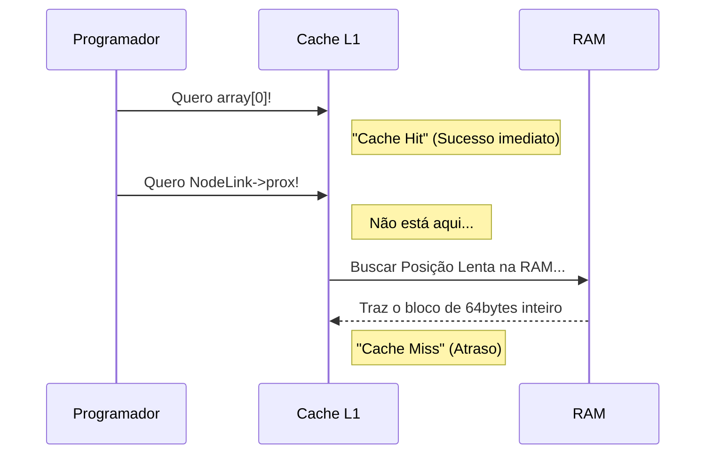

<!-- .element: class="fragment" -->
# Cache e Localidade
## Aula 06

---

## ✅ 1. Cache Hit e Cache Miss

O desempenho do seu loop `for()` depende maciçamente da *Cache Hit Rate*.

- **Cache Hit:** Acerto! A CPU pediu a posição `[1]`, ela já estava na Cache e a conta foi resolvida quase imediatamente.
- **Cache Miss:** Erro! O processador precisou parar o Pipeline, ir até a RAM lenta, injetar o bloco de bytes na lenta escalada D-Cache/L3/L2/L1 e prosseguir.

---

---

## 🗺️ 2. Localidade Espacial vs Temporal

As duas premissas arquiteturais da Localidade em Sistemas de Computação (que fundamentam toda escrita C/C++ otimizada):

    Se o programa acessou a variável na posição de memória `X`, há extrema probabilidade de que no ciclo de CPU seguinte ele acesse a variável de memória `X + 1`.
    *O clássico caso dos **Arrays Continuos (std::vector)**, garantindo varredura limpa em Hit sequencial absoluto de 64 em 64 bytes.*

    Se o programa visitou a variável `Y` agora, há enorme probabilidade dele visitá-la nos próximos ms.
    *O clássico caso das **Variáveis Locais e Contadores Padrões (`int i = 0`)** retidos brutalmente no Registrador ou na L1.*

---

---

## 🧨 3. False Sharing e Lógica Invertida (A Morte do C++)

> [!WARNING]
> O vilão máximo da performance: Iterar sobre matrizes pela *Coluna* ao invés da *Linha*. A imagem matriz na RAM C/C++ (Row-major order) exige saltos. E *False Sharing* ocorre quando threads isoladas atualizam variáveis contíguas da mesma linha de Cache de 64 bytes, forçando o Hardware (Cache Coherence Protocol) a invalidar repetitivas vezes L1/L2, triturando toda métrica.

A estrutura define a localidade espacial. Prefira dezenas de minúsculas variáveis sequenciais nos métodos a usar longos grafos com saltos randômicos baseados em ponteiros, se for iterar a esmo.

