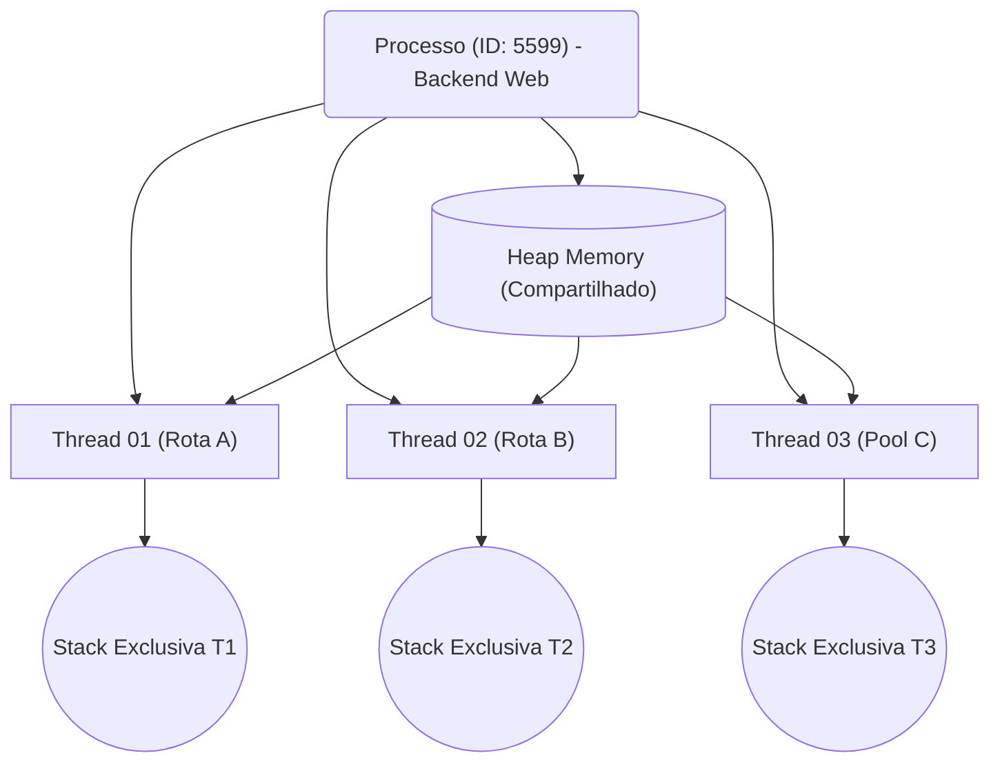

<!-- .element: class="fragment" -->
# Processos e Threads
## Aula 09

---

## 🏃 1. Processos (Isolamento Forte)

O Processo é o contêiner mestre do *Sistema Operacional*. Quando a execução do seu binário em C/C++ se inicia via Terminal, vira um Processo (`PID 2900`).

- O S.O. dá ao Processo sua *própria e exclusiva Memória Virtual* (visto na Aula 8).
- O Processo tem sua *exclusiva Pilha* e não se mistura nunca. E isso isola falhas: se um Chrome (processo isolado) trava, não dá tela azul na outra aba.
- A comunicação entre Processos (IPC - Inter-process Communication) é pesada e necessita do S.O. através de Pipes ou Redes. 

---

---

## 🧵 2. Threads (Isolamento Fraco / Partilha)

Quando se está em um jogo e, ao mesmo tempo que carrega os gráficos na GPU, uma música de CD está lendo sem travar, estamos olhando para **Multithreading**!

Uma Thread é simplesmente uma subdivisão leve controlada do processo. Elas todas orbitam e vivem na exata **MESMA MEMÓRIA VIRTUAL (Heap) DO PROCESSO MESTRE**.

    Duas `std::thread` manipulando os ponteiros apontam rigorosamente rápido ao mesmo endereço na RAM sem nenhuma barreira do S.O., o que traz milisegundos imbatíveis versus IPC!

---

## ⚙️ 3. Context Switch (A Faca de Dois Gumes)

Quando escrevemos `"Hello World"`, achamos que a CPU roda por horas sem interrupções. Engano.

O S.O. possui um núcleo (Kernel Scheduler) que fatia milésimos de milésimos de segundos distribuindo uma core `i7-P` para a aba do Google, logo retira o Google e taca nos frames do VS-Code, em micro-loop alternante de **Context Switches**.
O problema? Puxar e devolver o estado (registradores, program counter) na cache é hiper custoso e derruba o Pipeline se abusado (overhead em CPU bound apps).

---

## 🚀 Resumo Prático

- Se a tarefa for CPU-Bound (requerer Matemática Bruta Massiva / Machine Learning), você cria Threads numerando-as próximo número oficial de núcleos estritos da CPU, evitando desperdício de overhead com *Context Switches* ilusórios.
- É muito fácil em C/C++ estragar a vida financeira do cliente numa Race Condition compartilhada pelo Heap se não protegida... mas isso é o tema da próxima aula!

---

<!-- .element: class="fragment" -->
# 🧠 Quiz Rápido
## Prática de Fixação

---

### ❓ Pergunta 1
Sobre o funcionamento prático de **1. Processos (Isolamento Forte)** explicado em sala, indique a afirmativa verdadeira:

- **O Processo é o contêiner mestre do *Sistema Operacional*. Quando a execução do seu binário em C/C++ se inicia via Terminal, vira um Processo (`PID 2900`). *feedback: Afirmativo e Exato. Esta é rigorosamente a premissa central abordada no conteúdo de sala.***
- É uma limitação exclusiva de linguagens interpretadas muito antigas, sem nenhuma relação ao universo avançado do C/C++ moderno e CPUs atuais.
- Este paradigma foi totalmente descontinuado das arquiteturas vigentes porque o processador atua hoje com barramentos perfeitamente abstratos.
- A execução desse sub-processo opera de maneira paralela puramente abstrata, eximindo o Kernel do SO de gerenciar filas de execução.

---

### ✅ Resposta - Pergunta 1

**A alternativa correta é:**

O Processo é o contêiner mestre do *Sistema Operacional*. Quando a execução do seu binário em C/C++ se inicia via Terminal, vira um Processo (`PID 2900`). *feedback: Afirmativo e Exato. Esta é rigorosamente a premissa central abordada no conteúdo de sala.*

---

### ❓ Pergunta 2
No contexto analítico de **2. Threads (Isolamento Fraco / Partilha)** explicado em sala, indique a afirmativa verdadeira:

- **Quando se está em um jogo e, ao mesmo tempo que carrega os gráficos na GPU, uma música de CD está lendo sem travar, estamos olhando para **Multithreading**! *feedback: Afirmativo e Exato. Esta é rigorosamente a premissa central abordada no conteúdo de sala.***
- É uma limitação exclusiva de linguagens interpretadas muito antigas, sem nenhuma relação ao universo avançado do C/C++ moderno e CPUs atuais.
- Este paradigma foi totalmente descontinuado das arquiteturas vigentes porque o processador atua hoje com barramentos perfeitamente abstratos.
- A execução desse sub-processo opera de maneira paralela puramente abstrata, eximindo o Kernel do SO de gerenciar filas de execução.

---

### ✅ Resposta - Pergunta 2

**A alternativa correta é:**

Quando se está em um jogo e, ao mesmo tempo que carrega os gráficos na GPU, uma música de CD está lendo sem travar, estamos olhando para **Multithreading**! *feedback: Afirmativo e Exato. Esta é rigorosamente a premissa central abordada no conteúdo de sala.*

---

### ❓ Pergunta 3
Ao avaliar a característica inerente a **3. Context Switch (A Faca de Dois Gumes)** explicado em sala, indique a afirmativa verdadeira:

- **Quando escrevemos `"Hello World"`, achamos que a CPU roda por horas sem interrupções. Engano. *feedback: Afirmativo e Exato. Esta é rigorosamente a premissa central abordada no conteúdo de sala.***
- É uma limitação exclusiva de linguagens interpretadas muito antigas, sem nenhuma relação ao universo avançado do C/C++ moderno e CPUs atuais.
- Este paradigma foi totalmente descontinuado das arquiteturas vigentes porque o processador atua hoje com barramentos perfeitamente abstratos.
- A execução desse sub-processo opera de maneira paralela puramente abstrata, eximindo o Kernel do SO de gerenciar filas de execução.

---

### ✅ Resposta - Pergunta 3

**A alternativa correta é:**

Quando escrevemos `"Hello World"`, achamos que a CPU roda por horas sem interrupções. Engano. *feedback: Afirmativo e Exato. Esta é rigorosamente a premissa central abordada no conteúdo de sala.*

---

### ❓ Pergunta 4
A respeito da arquitetura sistêmica conectada a **Resumo Prático** explicado em sala, indique a afirmativa verdadeira:

- **- Se a tarefa for CPU-Bound (requerer Matemática Bruta Massiva / Machine Learning), você cria Threads numerando-as próximo número oficial de núcleos estritos da CPU, evitando desperdício de overhead com *Context Switches... *feedback: Afirmativo e Exato. Esta é rigorosamente a premissa central abordada no conteúdo de sala.***
- É uma limitação exclusiva de linguagens interpretadas muito antigas, sem nenhuma relação ao universo avançado do C/C++ moderno e CPUs atuais.
- Este paradigma foi totalmente descontinuado das arquiteturas vigentes porque o processador atua hoje com barramentos perfeitamente abstratos.
- A execução desse sub-processo opera de maneira paralela puramente abstrata, eximindo o Kernel do SO de gerenciar filas de execução.

---

### ✅ Resposta - Pergunta 4

**A alternativa correta é:**

- Se a tarefa for CPU-Bound (requerer Matemática Bruta Massiva / Machine Learning), você cria Threads numerando-as próximo número oficial de núcleos estritos da CPU, evitando desperdício de overhead com *Context Switches... *feedback: Afirmativo e Exato. Esta é rigorosamente a premissa central abordada no conteúdo de sala.*

---

### ❓ Pergunta 5
No que tange diretamente a lógica de **1. Processos (Isolamento Forte)** explicado em sala, indique a afirmativa verdadeira:

- **O Processo é o contêiner mestre do *Sistema Operacional*. Quando a execução do seu binário em C/C++ se inicia via Terminal, vira um Processo (`PID 2900`). *feedback: Afirmativo e Exato. Esta é rigorosamente a premissa central abordada no conteúdo de sala.***
- É uma limitação exclusiva de linguagens interpretadas muito antigas, sem nenhuma relação ao universo avançado do C/C++ moderno e CPUs atuais.
- Este paradigma foi totalmente descontinuado das arquiteturas vigentes porque o processador atua hoje com barramentos perfeitamente abstratos.
- A execução desse sub-processo opera de maneira paralela puramente abstrata, eximindo o Kernel do SO de gerenciar filas de execução.

---

### ✅ Resposta - Pergunta 5

**A alternativa correta é:**

O Processo é o contêiner mestre do *Sistema Operacional*. Quando a execução do seu binário em C/C++ se inicia via Terminal, vira um Processo (`PID 2900`). *feedback: Afirmativo e Exato. Esta é rigorosamente a premissa central abordada no conteúdo de sala.*

---

### ❓ Pergunta 6
Sobre o funcionamento prático de **2. Threads (Isolamento Fraco / Partilha)** explicado em sala, indique a afirmativa verdadeira:

- **Quando se está em um jogo e, ao mesmo tempo que carrega os gráficos na GPU, uma música de CD está lendo sem travar, estamos olhando para **Multithreading**! *feedback: Afirmativo e Exato. Esta é rigorosamente a premissa central abordada no conteúdo de sala.***
- É uma limitação exclusiva de linguagens interpretadas muito antigas, sem nenhuma relação ao universo avançado do C/C++ moderno e CPUs atuais.
- Este paradigma foi totalmente descontinuado das arquiteturas vigentes porque o processador atua hoje com barramentos perfeitamente abstratos.
- A execução desse sub-processo opera de maneira paralela puramente abstrata, eximindo o Kernel do SO de gerenciar filas de execução.

---

### ✅ Resposta - Pergunta 6

**A alternativa correta é:**

Quando se está em um jogo e, ao mesmo tempo que carrega os gráficos na GPU, uma música de CD está lendo sem travar, estamos olhando para **Multithreading**! *feedback: Afirmativo e Exato. Esta é rigorosamente a premissa central abordada no conteúdo de sala.*

---

### ❓ Pergunta 7
No contexto analítico de **3. Context Switch (A Faca de Dois Gumes)** explicado em sala, indique a afirmativa verdadeira:

- **Quando escrevemos `"Hello World"`, achamos que a CPU roda por horas sem interrupções. Engano. *feedback: Afirmativo e Exato. Esta é rigorosamente a premissa central abordada no conteúdo de sala.***
- É uma limitação exclusiva de linguagens interpretadas muito antigas, sem nenhuma relação ao universo avançado do C/C++ moderno e CPUs atuais.
- Este paradigma foi totalmente descontinuado das arquiteturas vigentes porque o processador atua hoje com barramentos perfeitamente abstratos.
- A execução desse sub-processo opera de maneira paralela puramente abstrata, eximindo o Kernel do SO de gerenciar filas de execução.

---

### ✅ Resposta - Pergunta 7

**A alternativa correta é:**

Quando escrevemos `"Hello World"`, achamos que a CPU roda por horas sem interrupções. Engano. *feedback: Afirmativo e Exato. Esta é rigorosamente a premissa central abordada no conteúdo de sala.*

---

### ❓ Pergunta 8
Ao avaliar a característica inerente a **Resumo Prático** explicado em sala, indique a afirmativa verdadeira:

- **- Se a tarefa for CPU-Bound (requerer Matemática Bruta Massiva / Machine Learning), você cria Threads numerando-as próximo número oficial de núcleos estritos da CPU, evitando desperdício de overhead com *Context Switches... *feedback: Afirmativo e Exato. Esta é rigorosamente a premissa central abordada no conteúdo de sala.***
- É uma limitação exclusiva de linguagens interpretadas muito antigas, sem nenhuma relação ao universo avançado do C/C++ moderno e CPUs atuais.
- Este paradigma foi totalmente descontinuado das arquiteturas vigentes porque o processador atua hoje com barramentos perfeitamente abstratos.
- A execução desse sub-processo opera de maneira paralela puramente abstrata, eximindo o Kernel do SO de gerenciar filas de execução.

---

### ✅ Resposta - Pergunta 8

**A alternativa correta é:**

- Se a tarefa for CPU-Bound (requerer Matemática Bruta Massiva / Machine Learning), você cria Threads numerando-as próximo número oficial de núcleos estritos da CPU, evitando desperdício de overhead com *Context Switches... *feedback: Afirmativo e Exato. Esta é rigorosamente a premissa central abordada no conteúdo de sala.*

---

### ❓ Pergunta 9
A respeito da arquitetura sistêmica conectada a **1. Processos (Isolamento Forte)** explicado em sala, indique a afirmativa verdadeira:

- **O Processo é o contêiner mestre do *Sistema Operacional*. Quando a execução do seu binário em C/C++ se inicia via Terminal, vira um Processo (`PID 2900`). *feedback: Afirmativo e Exato. Esta é rigorosamente a premissa central abordada no conteúdo de sala.***
- É uma limitação exclusiva de linguagens interpretadas muito antigas, sem nenhuma relação ao universo avançado do C/C++ moderno e CPUs atuais.
- Este paradigma foi totalmente descontinuado das arquiteturas vigentes porque o processador atua hoje com barramentos perfeitamente abstratos.
- A execução desse sub-processo opera de maneira paralela puramente abstrata, eximindo o Kernel do SO de gerenciar filas de execução.

---

### ✅ Resposta - Pergunta 9

**A alternativa correta é:**

O Processo é o contêiner mestre do *Sistema Operacional*. Quando a execução do seu binário em C/C++ se inicia via Terminal, vira um Processo (`PID 2900`). *feedback: Afirmativo e Exato. Esta é rigorosamente a premissa central abordada no conteúdo de sala.*

---

### ❓ Pergunta 10
No que tange diretamente a lógica de **2. Threads (Isolamento Fraco / Partilha)** explicado em sala, indique a afirmativa verdadeira:

- **Quando se está em um jogo e, ao mesmo tempo que carrega os gráficos na GPU, uma música de CD está lendo sem travar, estamos olhando para **Multithreading**! *feedback: Afirmativo e Exato. Esta é rigorosamente a premissa central abordada no conteúdo de sala.***
- É uma limitação exclusiva de linguagens interpretadas muito antigas, sem nenhuma relação ao universo avançado do C/C++ moderno e CPUs atuais.
- Este paradigma foi totalmente descontinuado das arquiteturas vigentes porque o processador atua hoje com barramentos perfeitamente abstratos.
- A execução desse sub-processo opera de maneira paralela puramente abstrata, eximindo o Kernel do SO de gerenciar filas de execução.

---

### ✅ Resposta - Pergunta 10

**A alternativa correta é:**

Quando se está em um jogo e, ao mesmo tempo que carrega os gráficos na GPU, uma música de CD está lendo sem travar, estamos olhando para **Multithreading**! *feedback: Afirmativo e Exato. Esta é rigorosamente a premissa central abordada no conteúdo de sala.*

