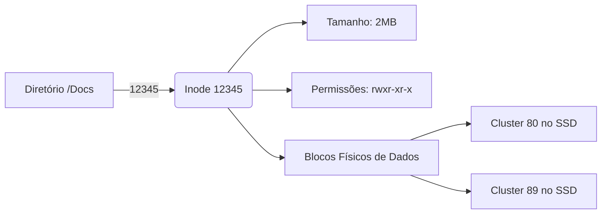

<!-- .element: class="fragment" -->
# Aula 14 - Sistemas de Arquivos
## Apresentação

---

Um Hardware (SSD vazio) nada mais é que um deserto de bilhões de celulas silício aptas a guardar carga estática. Sem um `Software Organizador`, é indomávél. O **File System (Sistema de Arquivos)** é esse gerenciador fornecido pelo Sistema Operacional.

---

---

<!-- .element: class="fragment" -->
# Novo Tópico
## 🗂️ 1. O V-Node / Inode

---

## 🗂️ 1. O V-Node / Inode

Se no seu PC existe a pasta `Docs/foto.jpg`, no fundo, o Linux não rastreia o texto "foto.jpg" para pular de cluster em cluster. 
O FS usa de índices numéricos ultra-rápidos: os **Inodes**.

---

## 🗂️ 1. O V-Node / Inode

---

## 🗂️ 1. O V-Node / Inode

> [!INFO]
> Por que o comando de *Deletar (rm)* um arquivo grande é quase instantâneo, mas copiar é lento?
> O `rm` apaga apenas a entrada no Índice (Inode), fingindo pro SO que o espaço tá livre. O dado mesmo ainda tá lá magnetizado até algo escrever por cima (Por isso existem softwares de recuperação de dados!)

---

## 🗂️ 1. O V-Node / Inode

---

---

<!-- .element: class="fragment" -->
# Novo Tópico
## 🛡️ 2. Journaling (A Prova contra Quedas)

---

## 🛡️ 2. Journaling (A Prova contra Quedas)

Mudar um arquivo é uma transação: Apagar o velho, escrever o novo, mudar o Inode.
E se faltar luz na etapa 2? A partição **corromperia inteiramente** para sempre (Problema antigo do FAT32).

FSs modernos (NTFS, EXT4) usam **Journaling**. Antes de aplicar qualquer mudança no Inode oficial, eles "anotam a intenção do que vão fazer" num Diário Oculto (Journal). Se a luz cai, ao ligar o PC, ele lê o diário oculto incompleto, reverte o estrago e devolve sua máquina salva! É a essência do conceito *Atomicidade*.

---

## 🛡️ 2. Journaling (A Prova contra Quedas)

---

---

<!-- .element: class="fragment" -->
# Novo Tópico
## 🚄 3. Buffers e Page Cache (Por que Linux é Rápido)

---

## 🚄 3. Buffers e Page Cache (Por que Linux é Rápido)

"Escrever no disco" via SysCall C++ `write()` ou `fwrite()` raramente vai pro HD!
O Linux usa de forma abusiva toda a **RAM ociosa do seu computador** como um gigantesco *Cache File*. Ele capta suas writes e diz "Gravei amigão!" mas jogou na RAM (Page Cache). Posteriormente ele realiza os envios reais para o Hardware agrupados (*Flush / Sync*).

Essa mágica salva a Morte do seu SSD (menos gravações simultâneas em desgaste das celulas NAND) e simula uma ilusão de lentidão zero ao usuário.

---

<!-- .element: class="fragment" -->
# Novo Tópico
## 🚀 Resumo Prático

---

## 🚀 Resumo Prático

- Ao usar C/C++, chame o instrínseco `fsync()` se seu App for um Banco de Dados ou Software Crítico Bancário forçando a Cache RAM descarregar a força e salvar permanentemente no silício do disco.
- Nunca dependa da nomenclatura C: `/usr/foto.jpg`. Leia descritores de arquivo, file-pointers e fluxos binários se for transitar redes em baixo nível.

---

## 🚀 Resumo Prático

---