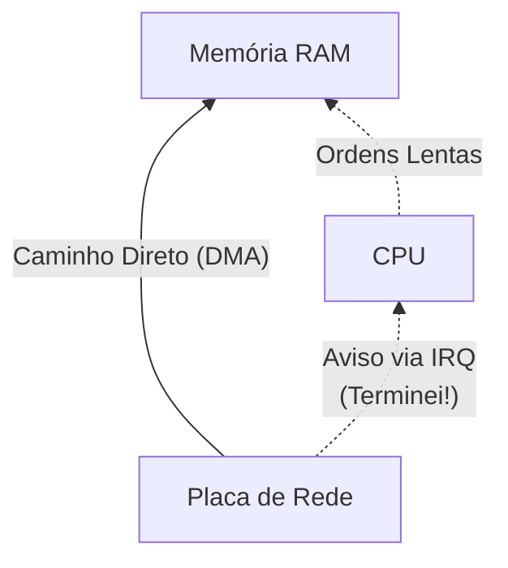

<!-- .element: class="fragment" -->
# Aula 15 - Entrada e Saída (I/O)
## Apresentação

---

Se o Processador e a Memória trabalham num relógio bilionário (GHz), como eles se comunicam com o Teclado USB do seu usuário ou sua Placa de Rede cuja resposta se mede nas lentas métricas de milissegundos?

---

---

<!-- .element: class="fragment" -->
# Novo Tópico
## 🚪 1. System Calls (O Pedágio do Kernel)

---

## 🚪 1. System Calls (O Pedágio do Kernel)

Programas nativos de C/C++ rodando na zona abstratamente segura (User Space) NÃO TÊM permissão física elétron-elétron para dar ordens ao cabo de Rede de imprimir um byte TCP. Tentar burlar isso gera um sumário e fulminante encerramento compulsório pelo Processador através do bloqueio de Anéis de Proteção.

Para acionar a Rede, o C++ precisa paralisar, invocar a sagrada **System Call** (Syscall, ex: _write_, _sendto_, _read_) que abre o portal para o S.O (Kernel Space). É o Kernel Linux quem vai orquestrar a placa C de Ethernet.

---

## 🚪 1. System Calls (O Pedágio do Kernel)

---

---

<!-- .element: class="fragment" -->
# Novo Tópico
## ⚠️ 2. Interrupções vs Polling

---

## ⚠️ 2. Interrupções vs Polling

Seu App em Python/C diz: "Puxe o dado que está vindo no mouse".
1. **Polling (Desastroso)**: A CPU fica travada rodando `while(mouse_is_empty) {}` perguntando de nano em nanosegundo "Chegou? E agora? E Agora?". (Suga 100% da CPU por um mouse inerte).
2. **Interrupts (Moderno)**: A CPU delega para o controlador USB rodar a escuta passiva, e a CPU volta a fechar os frames de Game. Quando o usuário clica com o dedo, o Controlador injeta um choque elétrico no pino do Processador. **Interrupt request (IRQ)!** A CPU congela subitamente o Game, salva o contexto, trata o clique do Mouse rapidamente, e exuma a cena do Game novamente do congelamento.

---

---

<!-- .element: class="fragment" -->
# Novo Tópico
## 🚀 3. DMA (Memória com Acesso Direto)

---

## 🚀 3. DMA (Memória com Acesso Direto)

Mesmo com as Interrupções ajudando a não ficar paralisado *Polling*... Fazer a Placa de Rede encher a placa RAM transitando Bit a Bit passando pelo miolo doloroso da CPU era impraticável em Gigabit Ethernets.

A revolução moderna chama-se **Direct Memory Access (DMA)**. Placas de Captura, NVMe e Placas de Rede conversam *Diretamente com a Memória RAM por vias de bypass*.

---

## 🚀 3. DMA (Memória com Acesso Direto)

---

## 🚀 3. DMA (Memória com Acesso Direto)

A CPU diz: "Placa, baixe o NetFlix do Ponto P pro Q na RAM". A Placa faz todo os trabalho violento por trás. A CPU usa seu pipeline pra cálculos e matemática puros, enquanto sua memória vai sendo injetada pela placa de vídeo via túneis secretos pelas pontes.

---

<!-- .element: class="fragment" -->
# Novo Tópico
## 🚀 Resumo Prático

---

## 🚀 Resumo Prático

- Se a sua aplicação Web Framework assíncrona (como NodeJS ou Nginx C++) trava muito com "I/O", isso significa que o Sistema delega operações custosas pelo DMA ao Kernel, enquanto orquestra Event-Loops aguardando os famigerados Interrupts de retorno.

---

## 🚀 Resumo Prático

Fim do estudo base teórico, chegamos ao final. É hora de compilar conhecimento na Otimização Pura (Aula Final).

---