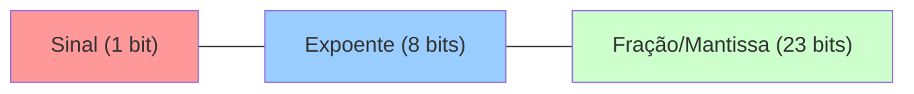

<!-- .element: class="fragment" -->
# Representação de Dados
## Aula 02

---

## 🔢 1. Sistema Binário e Hexadecimal

O computador compreende nativamente a base 2 (Binário). Como a escrita binária é muito longa para os humanos, nós a agrupamos em Blocos de 4 (Base 16 - Hexadecimal).

* **Bit**: 0 ou 1
* **Byte**: 8 bits (`00000000` a `11111111`, indo de 0 a 255 no decimal)

Por que `Hexadecimal` é amado pelos desenvolvedores C/C++? Um *Byte* (8 bits) pode ser perfeitamente representado por exatos dois caracteres Hexadecimais. `FF` é o mesmo que `11111111`.

<div class="termy" markdown="1">

---

## 🔋 2. Inteiros com e sem Sinal (Unsigned)

Em C/C++, o rigor nos tipos provém diretamente do hardware:

```cpp
int x = 255;           // Geralmente um int é 32 bits, comportando valores grandes, podendo ser negativo (signed).
unsigned char y = 255; // 8 bits sem sinal (0 a 255)
signed char z = -1;    // 8 bits com sinal (-128 a 127)
```

No hardware, inteiros negativos são representados usando a regra de **Complemento de 2**. Para obtermos o binário do `-1`, invertemos todos os bits de `1` e somamos `1`.

> [!WARNING]
> **Sempre avalie Overshoot.** Um loop usando `unsigned int i = 10; while(i >= 0)` será um loop infinito, porque quando `i` atingir 0 e for subtraído, ele *NUNCA* ficará negativo; ele executará o "Wrap-around" arquitetural, voltando ao valor limite de (`4.294.967.295`).

---

## 🧮 3. Ponto Flutuante (IEEE 754)

Os famosos tipos `float` e `double`. O processador possui normalmente um setor dedicado de FPU (Floating Point Unit) para eles.

A representação oficial **IEEE 754** os divide em 3 porções:



### O Perigo da Precisão!

---

## 🚀 Resumo Prático

A maneira como você escolhe o tipo primitivo da variável modela a fisionomia do registrador acionado na máquina durante o *fetch*. Entender o *Overflow* é a proteção básica contra corrupção lógica do código.