```mermaid
flowchart LR
    A["Sinal (1 bit)"] --- B["Expoente (8 bits)"] --- C["Fração/Mantissa (23 bits)"]
    style A fill:#ff9999
    style B fill:#99ccff
    style C fill:#ccffcc
```

<!-- .element: class="fragment" -->
# Aula 02 - Representação de Dados
## Apresentação

---

Ao cruzar a fronteira entre *software* e a CPU, descobrimos que não existem "Strings" ou "Imagens", existem apenas correntes elétricas ligadas ou desligadas (1s e 0s). Vamos analisar a estrutura sob a ótica de C/C++.

---

---

<!-- .element: class="fragment" -->
# Novo Tópico
## 🔢 1. Sistema Binário e Hexadecimal

---

## 🔢 1. Sistema Binário e Hexadecimal

O computador compreende nativamente a base 2 (Binário). Como a escrita binária é muito longa para os humanos, nós a agrupamos em Blocos de 4 (Base 16 - Hexadecimal).

* **Bit**: <span class="fragment">0 ou 1</span>
* **Byte**: <span class="fragment">8 bits (`00000000` a `11111111`, indo de 0 a 255 no decimal)</span>

---

## 🔢 1. Sistema Binário e Hexadecimal

Por que `Hexadecimal` é amado pelos desenvolvedores C/C++? Um *Byte* (8 bits) pode ser perfeitamente representado por exatos dois caracteres Hexadecimais. `FF` é o mesmo que `11111111`.

---

## 🔢 1. Sistema Binário e Hexadecimal

<div class="termy" markdown="1">

__CODE_BLOCK_0__

</div>

---

## 🔢 1. Sistema Binário e Hexadecimal

---

---

<!-- .element: class="fragment" -->
# Novo Tópico
## 🔋 2. Inteiros com e sem Sinal (Unsigned)

---

## 🔋 2. Inteiros com e sem Sinal (Unsigned)

Em C/C++, o rigor nos tipos provém diretamente do hardware:

---

## 🔋 2. Inteiros com e sem Sinal (Unsigned)

```cpp
int x = 255;           // Geralmente um int é 32 bits, comportando valores grandes, podendo ser negativo (signed).
unsigned char y = 255; // 8 bits sem sinal (0 a 255)
signed char z = -1;    // 8 bits com sinal (-128 a 127)
```

---

## 🔋 2. Inteiros com e sem Sinal (Unsigned)

No hardware, inteiros negativos são representados usando a regra de **Complemento de 2**. Para obtermos o binário do `-1`, invertemos todos os bits de `1` e somamos `1`.

---

## 🔋 2. Inteiros com e sem Sinal (Unsigned)

> [!WARNING]
> **Sempre avalie Overshoot.** Um loop usando `unsigned int i = 10; while(i >= 0)` será um loop infinito, porque quando `i` atingir 0 e for subtraído, ele *NUNCA* ficará negativo; ele executará o "Wrap-around" arquitetural, voltando ao valor limite de (`4.294.967.295`).

---

## 🔋 2. Inteiros com e sem Sinal (Unsigned)

---

---

<!-- .element: class="fragment" -->
# Novo Tópico
## 🧮 3. Ponto Flutuante (IEEE 754)

---

## 🧮 3. Ponto Flutuante (IEEE 754)

Os famosos tipos `float` e `double`. O processador possui normalmente um setor dedicado de FPU (Floating Point Unit) para eles.

A representação oficial **IEEE 754** os divide em 3 porções:

---

## 🧮 3. Ponto Flutuante (IEEE 754)



---

## 🧮 3. Ponto Flutuante (IEEE 754)

### O Perigo da Precisão!

---

## 🧮 3. Ponto Flutuante (IEEE 754)

> [!CAUTION]
> Ao somar decimais repetidamente, as variações de mantissa geram margens de erro: `0.1 + 0.2` raramente é exatamente `0.3` na FPU, mas sim `0.30000000000000004`! Evite comparadores igualitários (`==`) em floats. Jamais use floats transacionando valores bancários estritos em backend, use estruturas customizadas dimensionais inteiras.

---

<!-- .element: class="fragment" -->
# Novo Tópico
## 🚀 Resumo Prático

---

## 🚀 Resumo Prático

A maneira como você escolhe o tipo primitivo da variável modela a fisionomia do registrador acionado na máquina durante o *fetch*. Entender o *Overflow* é a proteção básica contra corrupção lógica do código.

---