```mermaid
graph LR
    A["Ponteiro em C++<br/>(Virtual 0x01)"] --> B{"MMU e<br/>Page Table"}
    B --> C("Memória RAM<br/>(Física Pente 1)")
    B -. "Se não houver espaço" .-> D("Swap / Pagefile<br/>(SSD)")
```

<!-- .element: class="fragment" -->
# Aula 08 - Memória Virtual
## Apresentação

---

Se você pedir ao seu S.O. no Task Manager por quantos Gigabytes os aplicativos rodam, verá que a soma ultrapassa facilmente a capacidade real física do pente de RAM DDR inserido na placa mãe. Como isso é magicamente contido?

---

---

<!-- .element: class="fragment" -->
# Novo Tópico
## 🕳️ 1. O Abismo Lógico: A Memória Virtual

---

## 🕳️ 1. O Abismo Lógico: A Memória Virtual

Nenhum aplicativo C/C++ ou interpretador em execução roda interagindo fisicamente e sabendo explicitamente qual é o transistor fixo lá no pente da Kingston RAM na placa do data-center.

Todo processo que o Linux constrói roda dentro de uma gigante **Ilusão**. O endereço do seu ponteiro `0x7ffeeB...` em C++ é falso (Endereço Lógico).

---

## 🕳️ 1. O Abismo Lógico: A Memória Virtual

O HW (Hardware MMU no processador) mais as planilhas do Sistema Operacional (Page Tables) formencem a ligação dinâmica e escondida pra sua aplicação.

---

## 🕳️ 1. O Abismo Lógico: A Memória Virtual

---

## 🕳️ 1. O Abismo Lógico: A Memória Virtual

A **Memória Virtual (VM)** é um sanduíche mental e isolador protetor usado pelo S.O.
Ela entrega para o ponteiro do processo o pretexto visual de que ele tem toda a memória que ele quiser num universo contínuo livre.

---

---

<!-- .element: class="fragment" -->
# Novo Tópico
## 📄 2. TLB, MMU e a Tradução da Página

---

## 📄 2. TLB, MMU e a Tradução da Página

> Cada tradução do falso ponteiro visual com base nas tabelas em RAM é custoso (Cycle Penalty).

---

## 📄 2. TLB, MMU e a Tradução da Página

Para driblar isso, a arquitetura moderna usa a **TLB (Translation Lookaside Buffer)**. A TLB é uma Cache dentro da CPU que guarda apenas os dicionários recentes das planilhas de referências que dizem se o "0X7FFA falso vira bloco 344 do pente de DDR5 real".

---

## 📄 2. TLB, MMU e a Tradução da Página

### Page Hit e Page Fault

- **Page Hit:** A tradução ocorreu instatâneamente pela cache veloz na CPU (a TLB validou o ponteiro do C++ localizando logo onde está no metal a variável no chip Kingston).
    - **Page Fault Limitrofico:** A TLB errou e teve que rolar pra Main RAM puxando o endereço mapeado localizando num novo cluster na pilha. (100+ ciclos)
    - **Page Fault Crítico (SWAP):** A máquina não acha e entra em Swapping com o SSD (SSD Swap). É ali que ocorre as quedas colossais para "Travamento de Janela", a CPU foi pro SSD buscar um arquivo gigante que o Linux ejetou lá, pra trazer e rebotar pra cima pra Memória RAM física real, jogando pro seu código que achava estar "na memória" e dormiu (Milhões de ciclos).

---

## 📄 2. TLB, MMU e a Tradução da Página

---

---

<!-- .element: class="fragment" -->
# Novo Tópico
## 💪 3. Driblando a Paginação como Programador

---

## 💪 3. Driblando a Paginação como Programador

Ao iterarmos matrizes massivas (Matrizes 2D em C++) na ordem invertida ou em lógicas dispersas `LinkedList->prox`, você não causa apenas *Cache Miss* da Aula 06. Você também destrói toda a cache de pontes *TLB Misses*! Você induzirá Page Faults insanos que derrubarão o throughput (taxa de transferência de dados) em N fatores.

Portanto: **Localidade Espacial é sagrada em Dados C/C++**.

---

<!-- .element: class="fragment" -->
# Novo Tópico
## 🚀 Resumo Prático

---

## 🚀 Resumo Prático

- O ponteiro que o dev manipula com um `int *ptr = &value` em qualquer IDE é puramente 100% Virtual. É o passaporte intermediário.
- Nunca dependa da paginação e arquivo local de Swap do Disco: os milésimos de segundo viram minutos na Nuvem se o app "estourar a cota da cloud", sofrendo `Thrashing` com o Disco local para falsificar a RAM que ele acreditou ter num loop mal codificado ou em Leaks do Módulo/Aula anterior.

---

## 🚀 Resumo Prático

---