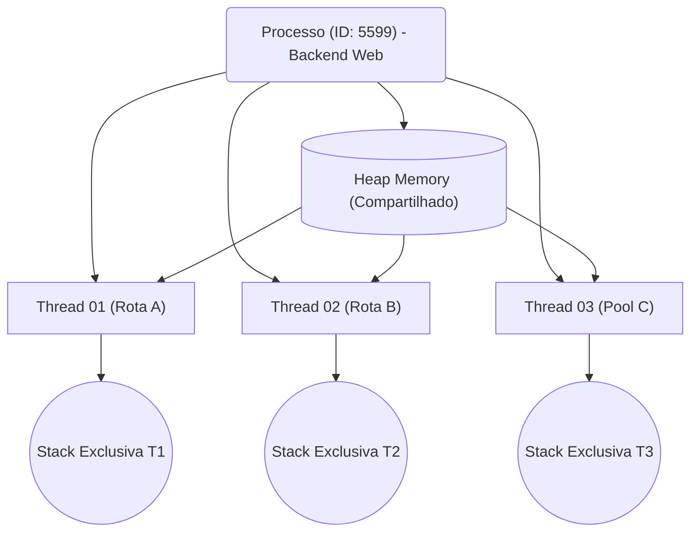

<!-- .element: class="fragment" -->
# Aula 09 - Processos e Threads
## Apresentação

---

É vital dominar como espalhar execuções concorrentes na topologia de múltiplos núcleos nos processadores de hoje. Caso contrário, um computador com 32 *cores* rodará seu backend Python (que possui GIL) de altíssima latência amargando 31 núcleos ociosos gastando energia.

---

---

<!-- .element: class="fragment" -->
# Novo Tópico
## 🏃 1. Processos (Isolamento Forte)

---

## 🏃 1. Processos (Isolamento Forte)

O Processo é o contêiner mestre do *Sistema Operacional*. Quando a execução do seu binário em C/C++ se inicia via Terminal, vira um Processo (`PID 2900`).

- O S.O. dá ao Processo sua *própria e exclusiva Memória Virtual* (visto na Aula 8).
- O Processo tem sua *exclusiva Pilha* e não se mistura nunca. E isso isola falhas: se um Chrome (processo isolado) trava, não dá tela azul na outra aba.
- A comunicação entre Processos (IPC - Inter-process Communication) é pesada e necessita do S.O. através de Pipes ou Redes.

---

## 🏃 1. Processos (Isolamento Forte)

---

---

<!-- .element: class="fragment" -->
# Novo Tópico
## 🧵 2. Threads (Isolamento Fraco / Partilha)

---

## 🧵 2. Threads (Isolamento Fraco / Partilha)

Quando se está em um jogo e, ao mesmo tempo que carrega os gráficos na GPU, uma música de CD está lendo sem travar, estamos olhando para **Multithreading**!

---

## 🧵 2. Threads (Isolamento Fraco / Partilha)

---

## 🧵 2. Threads (Isolamento Fraco / Partilha)

Uma Thread é simplesmente uma subdivisão leve controlada do processo. Elas todas orbitam e vivem na exata **MESMA MEMÓRIA VIRTUAL (Heap) DO PROCESSO MESTRE**.

---

## 🧵 2. Threads (Isolamento Fraco / Partilha)

### Benefício

Duas `std::thread` manipulando os ponteiros apontam rigorosamente rápido ao mesmo endereço na RAM sem nenhuma barreira do S.O., o que traz milisegundos imbatíveis versus IPC!
=== "Catástrofe"
    Como ambas alteram ativamente a mesmíssima RAM viva desprotegidas, se elas lerem/sobreescreverem juntas o mesmo byte int da Conta Bancária C++, ocorre o letífero e maldoso **Data Race** (Condição de Corrida de Dados).

---

## 🧵 2. Threads (Isolamento Fraco / Partilha)

---

---

<!-- .element: class="fragment" -->
# Novo Tópico
## ⚙️ 3. Context Switch (A Faca de Dois Gumes)

---

## ⚙️ 3. Context Switch (A Faca de Dois Gumes)

Quando escrevemos `"Hello World"`, achamos que a CPU roda por horas sem interrupções. Engano.

O S.O. possui um núcleo (Kernel Scheduler) que fatia milésimos de milésimos de segundos distribuindo uma core `i7-P` para a aba do Google, logo retira o Google e taca nos frames do VS-Code, em micro-loop alternante de **Context Switches**.
O problema? Puxar e devolver o estado (registradores, program counter) na cache é hiper custoso e derruba o Pipeline se abusado (overhead em CPU bound apps).

---

<!-- .element: class="fragment" -->
# Novo Tópico
## 🚀 Resumo Prático

---

## 🚀 Resumo Prático

- Se a tarefa for CPU-Bound (requerer Matemática Bruta Massiva / Machine Learning), você cria Threads numerando-as próximo número oficial de núcleos estritos da CPU, evitando desperdício de overhead com *Context Switches* ilusórios.
- É muito fácil em C/C++ estragar a vida financeira do cliente numa Race Condition compartilhada pelo Heap se não protegida... mas isso é o tema da próxima aula!

---

## 🚀 Resumo Prático

---