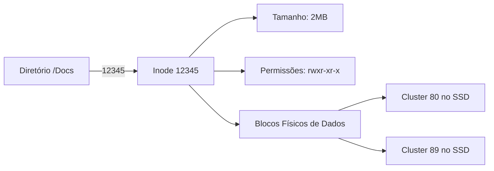

<!-- .element: class="fragment" -->
# Sistemas de Arquivos
## Aula 14

---

## 🗂️ 1. O V-Node / Inode

Se no seu PC existe a pasta `Docs/foto.jpg`, no fundo, o Linux não rastreia o texto "foto.jpg" para pular de cluster em cluster. 
O FS usa de índices numéricos ultra-rápidos: os **Inodes**. 

> [!INFO]
> Por que o comando de *Deletar (rm)* um arquivo grande é quase instantâneo, mas copiar é lento?
> O `rm` apaga apenas a entrada no Índice (Inode), fingindo pro SO que o espaço tá livre. O dado mesmo ainda tá lá magnetizado até algo escrever por cima (Por isso existem softwares de recuperação de dados!)

---

---

## 🛡️ 2. Journaling (A Prova contra Quedas)

Mudar um arquivo é uma transação: Apagar o velho, escrever o novo, mudar o Inode.
E se faltar luz na etapa 2? A partição **corromperia inteiramente** para sempre (Problema antigo do FAT32).

FSs modernos (NTFS, EXT4) usam **Journaling**. Antes de aplicar qualquer mudança no Inode oficial, eles "anotam a intenção do que vão fazer" num Diário Oculto (Journal). Se a luz cai, ao ligar o PC, ele lê o diário oculto incompleto, reverte o estrago e devolve sua máquina salva! É a essência do conceito *Atomicidade*.

---

---

## 🚄 3. Buffers e Page Cache (Por que Linux é Rápido)

"Escrever no disco" via SysCall C++ `write()` ou `fwrite()` raramente vai pro HD!
O Linux usa de forma abusiva toda a **RAM ociosa do seu computador** como um gigantesco *Cache File*. Ele capta suas writes e diz "Gravei amigão!" mas jogou na RAM (Page Cache). Posteriormente ele realiza os envios reais para o Hardware agrupados (*Flush / Sync*).

Essa mágica salva a Morte do seu SSD (menos gravações simultâneas em desgaste das celulas NAND) e simula uma ilusão de lentidão zero ao usuário.

---

## 🚀 Resumo Prático

- Ao usar C/C++, chame o instrínseco `fsync()` se seu App for um Banco de Dados ou Software Crítico Bancário forçando a Cache RAM descarregar a força e salvar permanentemente no silício do disco.
- Nunca dependa da nomenclatura C: `/usr/foto.jpg`. Leia descritores de arquivo, file-pointers e fluxos binários se for transitar redes em baixo nível.

---

<!-- .element: class="fragment" -->
# 🧠 Quiz Rápido
## Prática de Fixação

---

### ❓ Pergunta 1
Sobre o funcionamento prático de **1. O V-Node / Inode** explicado em sala, indique a afirmativa verdadeira:

- **Se no seu PC existe a pasta `Docs/foto.jpg`, no fundo, o Linux não rastreia o texto "foto.jpg" para pular de cluster em cluster. *feedback: Afirmativo e Exato. Esta é rigorosamente a premissa central abordada no conteúdo de sala.***
- É uma limitação exclusiva de linguagens interpretadas muito antigas, sem nenhuma relação ao universo avançado do C/C++ moderno e CPUs atuais.
- Este paradigma foi totalmente descontinuado das arquiteturas vigentes porque o processador atua hoje com barramentos perfeitamente abstratos.
- A execução desse sub-processo opera de maneira paralela puramente abstrata, eximindo o Kernel do SO de gerenciar filas de execução.

---

### ✅ Resposta - Pergunta 1

**A alternativa correta é:**

Se no seu PC existe a pasta `Docs/foto.jpg`, no fundo, o Linux não rastreia o texto "foto.jpg" para pular de cluster em cluster. *feedback: Afirmativo e Exato. Esta é rigorosamente a premissa central abordada no conteúdo de sala.*

---

### ❓ Pergunta 2
No contexto analítico de **2. Journaling (A Prova contra Quedas)** explicado em sala, indique a afirmativa verdadeira:

- **Mudar um arquivo é uma transação: Apagar o velho, escrever o novo, mudar o Inode. *feedback: Afirmativo e Exato. Esta é rigorosamente a premissa central abordada no conteúdo de sala.***
- É uma limitação exclusiva de linguagens interpretadas muito antigas, sem nenhuma relação ao universo avançado do C/C++ moderno e CPUs atuais.
- Este paradigma foi totalmente descontinuado das arquiteturas vigentes porque o processador atua hoje com barramentos perfeitamente abstratos.
- A execução desse sub-processo opera de maneira paralela puramente abstrata, eximindo o Kernel do SO de gerenciar filas de execução.

---

### ✅ Resposta - Pergunta 2

**A alternativa correta é:**

Mudar um arquivo é uma transação: Apagar o velho, escrever o novo, mudar o Inode. *feedback: Afirmativo e Exato. Esta é rigorosamente a premissa central abordada no conteúdo de sala.*

---

### ❓ Pergunta 3
Ao avaliar a característica inerente a **3. Buffers e Page Cache (Por que Linux é Rápido)** explicado em sala, indique a afirmativa verdadeira:

- **"Escrever no disco" via SysCall C++ `write()` ou `fwrite()` raramente vai pro HD! *feedback: Afirmativo e Exato. Esta é rigorosamente a premissa central abordada no conteúdo de sala.***
- É uma limitação exclusiva de linguagens interpretadas muito antigas, sem nenhuma relação ao universo avançado do C/C++ moderno e CPUs atuais.
- Este paradigma foi totalmente descontinuado das arquiteturas vigentes porque o processador atua hoje com barramentos perfeitamente abstratos.
- A execução desse sub-processo opera de maneira paralela puramente abstrata, eximindo o Kernel do SO de gerenciar filas de execução.

---

### ✅ Resposta - Pergunta 3

**A alternativa correta é:**

"Escrever no disco" via SysCall C++ `write()` ou `fwrite()` raramente vai pro HD! *feedback: Afirmativo e Exato. Esta é rigorosamente a premissa central abordada no conteúdo de sala.*

---

### ❓ Pergunta 4
A respeito da arquitetura sistêmica conectada a **Resumo Prático** explicado em sala, indique a afirmativa verdadeira:

- **- Ao usar C/C++, chame o instrínseco `fsync()` se seu App for um Banco de Dados ou Software Crítico Bancário forçando a Cache RAM descarregar a força e salvar permanentemente no silício do disco. *feedback: Afirmativo e Exato. Esta é rigorosamente a premissa central abordada no conteúdo de sala.***
- É uma limitação exclusiva de linguagens interpretadas muito antigas, sem nenhuma relação ao universo avançado do C/C++ moderno e CPUs atuais.
- Este paradigma foi totalmente descontinuado das arquiteturas vigentes porque o processador atua hoje com barramentos perfeitamente abstratos.
- A execução desse sub-processo opera de maneira paralela puramente abstrata, eximindo o Kernel do SO de gerenciar filas de execução.

---

### ✅ Resposta - Pergunta 4

**A alternativa correta é:**

- Ao usar C/C++, chame o instrínseco `fsync()` se seu App for um Banco de Dados ou Software Crítico Bancário forçando a Cache RAM descarregar a força e salvar permanentemente no silício do disco. *feedback: Afirmativo e Exato. Esta é rigorosamente a premissa central abordada no conteúdo de sala.*

---

### ❓ Pergunta 5
No que tange diretamente a lógica de **1. O V-Node / Inode** explicado em sala, indique a afirmativa verdadeira:

- **Se no seu PC existe a pasta `Docs/foto.jpg`, no fundo, o Linux não rastreia o texto "foto.jpg" para pular de cluster em cluster. *feedback: Afirmativo e Exato. Esta é rigorosamente a premissa central abordada no conteúdo de sala.***
- É uma limitação exclusiva de linguagens interpretadas muito antigas, sem nenhuma relação ao universo avançado do C/C++ moderno e CPUs atuais.
- Este paradigma foi totalmente descontinuado das arquiteturas vigentes porque o processador atua hoje com barramentos perfeitamente abstratos.
- A execução desse sub-processo opera de maneira paralela puramente abstrata, eximindo o Kernel do SO de gerenciar filas de execução.

---

### ✅ Resposta - Pergunta 5

**A alternativa correta é:**

Se no seu PC existe a pasta `Docs/foto.jpg`, no fundo, o Linux não rastreia o texto "foto.jpg" para pular de cluster em cluster. *feedback: Afirmativo e Exato. Esta é rigorosamente a premissa central abordada no conteúdo de sala.*

---

### ❓ Pergunta 6
Sobre o funcionamento prático de **2. Journaling (A Prova contra Quedas)** explicado em sala, indique a afirmativa verdadeira:

- **Mudar um arquivo é uma transação: Apagar o velho, escrever o novo, mudar o Inode. *feedback: Afirmativo e Exato. Esta é rigorosamente a premissa central abordada no conteúdo de sala.***
- É uma limitação exclusiva de linguagens interpretadas muito antigas, sem nenhuma relação ao universo avançado do C/C++ moderno e CPUs atuais.
- Este paradigma foi totalmente descontinuado das arquiteturas vigentes porque o processador atua hoje com barramentos perfeitamente abstratos.
- A execução desse sub-processo opera de maneira paralela puramente abstrata, eximindo o Kernel do SO de gerenciar filas de execução.

---

### ✅ Resposta - Pergunta 6

**A alternativa correta é:**

Mudar um arquivo é uma transação: Apagar o velho, escrever o novo, mudar o Inode. *feedback: Afirmativo e Exato. Esta é rigorosamente a premissa central abordada no conteúdo de sala.*

---

### ❓ Pergunta 7
No contexto analítico de **3. Buffers e Page Cache (Por que Linux é Rápido)** explicado em sala, indique a afirmativa verdadeira:

- **"Escrever no disco" via SysCall C++ `write()` ou `fwrite()` raramente vai pro HD! *feedback: Afirmativo e Exato. Esta é rigorosamente a premissa central abordada no conteúdo de sala.***
- É uma limitação exclusiva de linguagens interpretadas muito antigas, sem nenhuma relação ao universo avançado do C/C++ moderno e CPUs atuais.
- Este paradigma foi totalmente descontinuado das arquiteturas vigentes porque o processador atua hoje com barramentos perfeitamente abstratos.
- A execução desse sub-processo opera de maneira paralela puramente abstrata, eximindo o Kernel do SO de gerenciar filas de execução.

---

### ✅ Resposta - Pergunta 7

**A alternativa correta é:**

"Escrever no disco" via SysCall C++ `write()` ou `fwrite()` raramente vai pro HD! *feedback: Afirmativo e Exato. Esta é rigorosamente a premissa central abordada no conteúdo de sala.*

---

### ❓ Pergunta 8
Ao avaliar a característica inerente a **Resumo Prático** explicado em sala, indique a afirmativa verdadeira:

- **- Ao usar C/C++, chame o instrínseco `fsync()` se seu App for um Banco de Dados ou Software Crítico Bancário forçando a Cache RAM descarregar a força e salvar permanentemente no silício do disco. *feedback: Afirmativo e Exato. Esta é rigorosamente a premissa central abordada no conteúdo de sala.***
- É uma limitação exclusiva de linguagens interpretadas muito antigas, sem nenhuma relação ao universo avançado do C/C++ moderno e CPUs atuais.
- Este paradigma foi totalmente descontinuado das arquiteturas vigentes porque o processador atua hoje com barramentos perfeitamente abstratos.
- A execução desse sub-processo opera de maneira paralela puramente abstrata, eximindo o Kernel do SO de gerenciar filas de execução.

---

### ✅ Resposta - Pergunta 8

**A alternativa correta é:**

- Ao usar C/C++, chame o instrínseco `fsync()` se seu App for um Banco de Dados ou Software Crítico Bancário forçando a Cache RAM descarregar a força e salvar permanentemente no silício do disco. *feedback: Afirmativo e Exato. Esta é rigorosamente a premissa central abordada no conteúdo de sala.*

---

### ❓ Pergunta 9
A respeito da arquitetura sistêmica conectada a **1. O V-Node / Inode** explicado em sala, indique a afirmativa verdadeira:

- **Se no seu PC existe a pasta `Docs/foto.jpg`, no fundo, o Linux não rastreia o texto "foto.jpg" para pular de cluster em cluster. *feedback: Afirmativo e Exato. Esta é rigorosamente a premissa central abordada no conteúdo de sala.***
- É uma limitação exclusiva de linguagens interpretadas muito antigas, sem nenhuma relação ao universo avançado do C/C++ moderno e CPUs atuais.
- Este paradigma foi totalmente descontinuado das arquiteturas vigentes porque o processador atua hoje com barramentos perfeitamente abstratos.
- A execução desse sub-processo opera de maneira paralela puramente abstrata, eximindo o Kernel do SO de gerenciar filas de execução.

---

### ✅ Resposta - Pergunta 9

**A alternativa correta é:**

Se no seu PC existe a pasta `Docs/foto.jpg`, no fundo, o Linux não rastreia o texto "foto.jpg" para pular de cluster em cluster. *feedback: Afirmativo e Exato. Esta é rigorosamente a premissa central abordada no conteúdo de sala.*

---

### ❓ Pergunta 10
No que tange diretamente a lógica de **2. Journaling (A Prova contra Quedas)** explicado em sala, indique a afirmativa verdadeira:

- **Mudar um arquivo é uma transação: Apagar o velho, escrever o novo, mudar o Inode. *feedback: Afirmativo e Exato. Esta é rigorosamente a premissa central abordada no conteúdo de sala.***
- É uma limitação exclusiva de linguagens interpretadas muito antigas, sem nenhuma relação ao universo avançado do C/C++ moderno e CPUs atuais.
- Este paradigma foi totalmente descontinuado das arquiteturas vigentes porque o processador atua hoje com barramentos perfeitamente abstratos.
- A execução desse sub-processo opera de maneira paralela puramente abstrata, eximindo o Kernel do SO de gerenciar filas de execução.

---

### ✅ Resposta - Pergunta 10

**A alternativa correta é:**

Mudar um arquivo é uma transação: Apagar o velho, escrever o novo, mudar o Inode. *feedback: Afirmativo e Exato. Esta é rigorosamente a premissa central abordada no conteúdo de sala.*

---

<!-- .element: class="fragment" -->
# 🥇 Conclusão Teórica
## Tópicos Superados

Você concluiu com sucesso a carga cognitiva desta apresentação teórica!

---

### 🚀 Próximas Etapas (Prática)

Agora que a conceituação inicial e os quizzes iterativos foram vencidos, aplique o conhecimento na prática:

- Acesse a plataforma e inicie o seu desafio em **Mini Projetos** de C/C++.
- Teste a fixação complexa com as questões dissertativas da **Lista de Exercícios**.